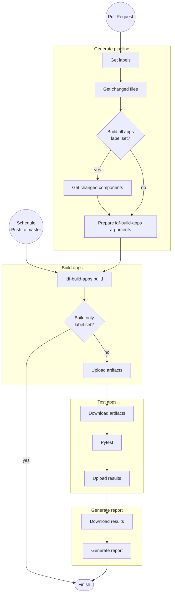

# CI in idf-extra-components

## Build and test apps

The workflow defined in [build_and_run_apps.yml](workflows/build_and_run_apps.yml) builds the apps (examples, test apps) and runs the tests on self-hosted runners.

