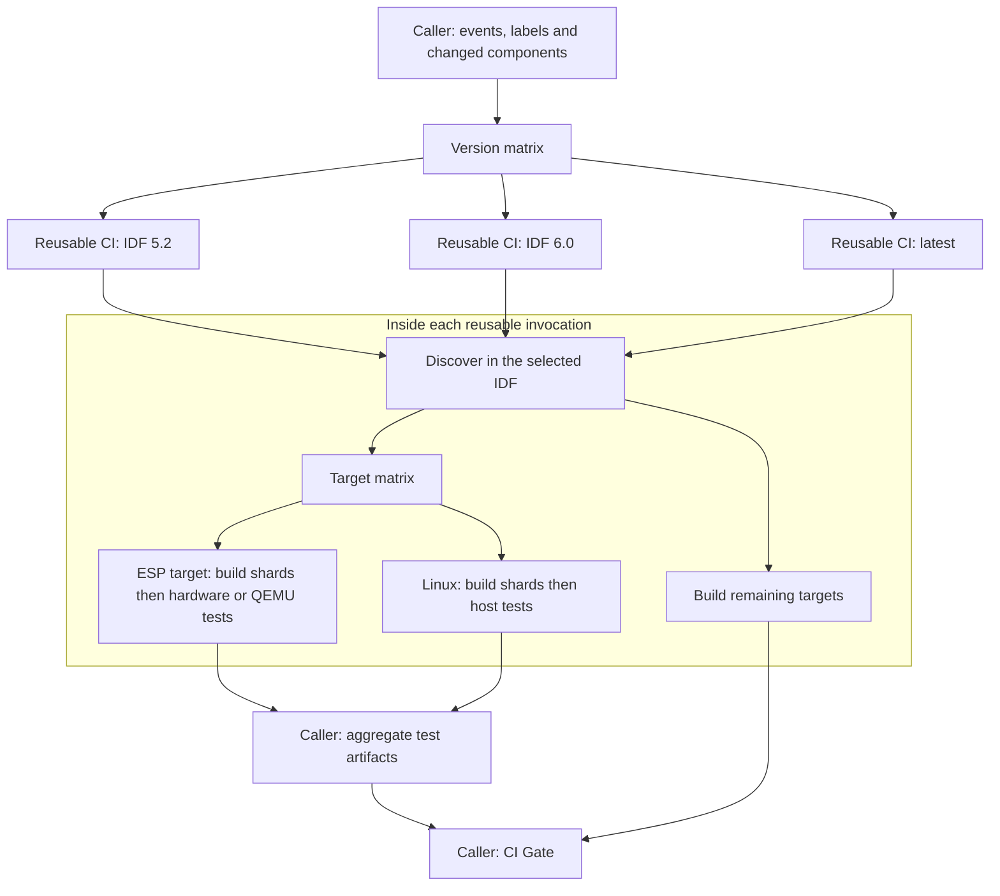

# CI in idf-extra-components

## Architecture

The caller chooses the ESP-IDF versions. The public
[reusable-ci.yml](workflows/reusable-ci.yml) executes a complete pipeline for
**one** version: discovery in that IDF environment, build shards, and tests.
It contains no release lists or special handling of `latest`.



[build_and_run_apps.yml](workflows/build_and_run_apps.yml) owns the PR, push
and schedule triggers, labels, component selection, reporting and stable
`CI Gate` status. Each target's tests wait only for that target's build
shards in its own IDF version. There is no cross-version matrix aggregation.

## Configuration and public inputs

Two project-owned files have separate responsibilities:

- [ci-matrix.json](ci-matrix.json): the caller's version matrix. Each entry
  contains an `idf_version` and a `test_profile`. This repository selects
  `no-linux-tests` for IDF 5.2 and 6.0; all other entries use `default`.
- [ci-config.json](ci-config.json): targets with individual build/test
  workers, runner mappings, shard limits and named profiles. A profile's
  `exclude_markers` disables those tests while retaining compile coverage.
  The planner handles all markers uniformly, including Ethernet and QEMU.

`reusable-ci.yml` accepts:

| Input | Default | Meaning |
| --- | --- | --- |
| `idf_version` | Required | Docker tag of `espressif/idf` |
| `config_file` | `.github/ci-config.json` | Project-owned runner and shard policy |
| `test_profile` | `default` | Named policy from that configuration |
| `run_tests` | `false` | Enable execution on the configured test runners |
| `modified_files` | `[]` | JSON array of changed file paths |
| `modified_components` | `[]` | JSON array of changed component names |
| `pipeline_id` | IDF version | Unique artifact namespace; override for repeated calls with the same version |

Empty selection arrays mean an unfiltered build. This repository's caller
uses [get_ci_changes.py](get_ci_changes.py) to select root-level components;
other repositories can provide their own selection data. The public workflow
does not accept shell fragments or require the caller to calculate shards.

The manifests and `.idf_build_apps.toml` remain in the project. They control
which apps and configurations are buildable in the current IDF. Discovery
sizes shards as `ceil(apps / runs_per_job)`, capped at `parallel_count`.
Changed-file/component filtering still happens at build time, so PRs may
need fewer nonempty shards than the full discovered inventory.

## Calling from another repository

After publishing a CI revision, reference that revision from the caller.
Replace `YOUR_CI_COMMIT_SHA` below with the published commit:

```yaml
jobs:
  ci:
    strategy:
      fail-fast: false
      matrix:
        idf_version: [release-v5.4, release-v6.0]
    uses: espressif/idf-extra-components/.github/workflows/reusable-ci.yml@YOUR_CI_COMMIT_SHA
    with:
      idf_version: ${{ matrix.idf_version }}
      config_file: .github/ci-config.json
      run_tests: true
```

A single-version caller can omit `strategy` and pass one `idf_version`.
The consumer supplies its app manifests, pytest configuration and runner
policy, but does not copy CI scripts. Shared scripts and pinned tool
requirements are shipped in the [ci-tools action](actions/ci-tools/action.yml).

The `$/` references to actions resolve against the CI workflow's repository
and commit; `actions/checkout` retrieves the consumer's project. This avoids
mixing project code with scripts from a different CI release. `$/` is a
GitHub.com feature and is not available on GitHub Enterprise Server; GHES
consumers need explicitly versioned shared-action references.
See [GitHub's self-repository action reference](https://docs.github.com/en/actions/reference/workflows-and-actions/workflow-syntax#example-using-an-action-in-the-same-repository-as-the-workflow-at-the-running-commit-recommended).

The internal [target worker](workflows/reusable-build-run-apps.yml) packages
runtime files using `build_info*.json`, preserving workspace-relative paths
and executable permissions in tar archives. It supports apps at the project
root and custom nested layouts. Artifacts are namespaced by pipeline ID,
target and shard; test reports add the runner marker. Configured markers
must be unique within each target. Custom build-directory conventions can
be supplied through each runner's `pytest_args`.

## Validation and remaining migration

Run the unit tests without installing ESP-IDF:

```sh
python3 -m unittest discover -s .github/tests -p 'test_*.py'
```

Run the planner inside each supported ESP-IDF image after sourcing its
`export.sh` and installing `actions/ci-tools/requirements.txt`:

```sh
GITHUB_OUTPUT=/tmp/ci.outputs python3 .github/actions/ci-tools/generate_build_matrix.py \
  --config .github/ci-config.json --profile default
```

Actionlint 1.7.12 does not yet recognize `$/` references. For that version,
ignore only its missing-ref diagnostic for the two shared actions:

```sh
actionlint -ignore '^specifying action "\$/\.github/actions/(ci-tools|setup-idf-build-env)" in invalid format because ref is missing'
```

`CI Gate` fails on any failed or cancelled dependency and accepts intentional
skips. Build-only runs skip runtime artifacts and tests. PRs with no changed
component skip the version pipelines while still running unit tests and the
structural pytest/manifest check. Use `PR: test all apps` to exercise the
full pipeline for CI-only changes. Fork/Dependabot PRs keep test summaries
without requiring write access for checks or comments.

Build execution still uses `idf-build-apps`, with the existing build-info
selection for pytest. Moving to `idf-ci build run` is a separate step in
[PLAN.md](../PLAN.md), particularly default configuration directories and
component dependency mapping.
