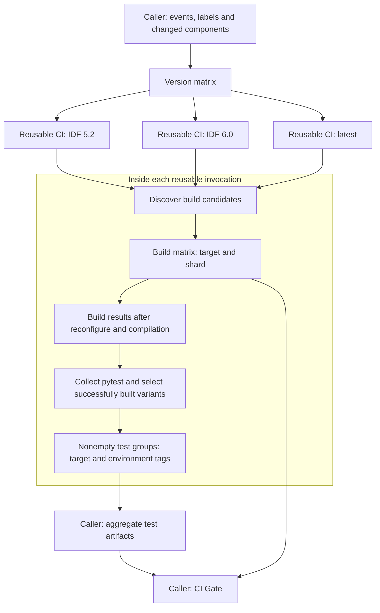

# CI in idf-extra-components

## Architecture

The caller chooses the ESP-IDF versions. The public
[reusable-ci.yml](workflows/reusable-ci.yml) executes a complete pipeline for
**one** version: discovery in that IDF environment, build shards, and tests.
It contains no release lists or special handling of `latest`.


```mermaid
flowchart TD
    caller[Caller: events, labels and changed components] --> versions[Version matrix]
    versions --> v52[Reusable CI: IDF 5.2]
    versions --> v60[Reusable CI: IDF 6.0]
    versions --> latest[Reusable CI: latest]
    subgraph one[Inside each reusable invocation]
        discover[Discover build candidates] --> builds[Build matrix: target and shard]
        builds --> results[Build results after reconfigure and compilation]
        results --> planner[Collect pytest and select successfully built variants]
        planner --> tests[Nonempty test groups: target and environment tags]
    end
    v52 --> discover
    v60 --> discover
    latest --> discover
    tests --> report[Caller: aggregate test artifacts]
    report --> gate[Caller: CI Gate]
    builds --> gate
```

[build_and_run_apps.yml](workflows/build_and_run_apps.yml) owns the PR, push
and schedule triggers, labels, component selection, reporting and stable
`CI Gate` status. Test planning waits for all build shards in its own IDF
version. Versions remain independent; there is no cross-version aggregation.

Build and test jobs include their target in the name. For example, under `CI (release-v5.5)`:

```text
Build esp32 (shard 1/2)
Build esp32 (shard 2/2)
Build esp32s3 (shard 1/2)
Build linux (shard 1/1)
Build esp32h4 (shard 1/2)
Plan tests from build results
Test esp32 (generic)
Test esp32s3 (qemu)
Test linux (host_test)
```

`shard 1/2` means the first of two parallel batches of applications for that
target. All targets use the same build job, including targets without pytest
cases. Linux builds select the host toolchain.

## Configuration and public inputs

Project-owned files have separate responsibilities:

- [ci-matrix.json](ci-matrix.json): a single `idf_version` array of Docker tags.
  Add one string to check a new SDK version; changing this file triggers a full
  CI run. The matrix contains no test exclusions.
- Component `.build-test-rules.yml` manifests: build compatibility by target,
  SDK version and configuration. Existing `disable_test` rules remain effective.
- `pytest_*.py`: test logic, targets and environment requirements.

There is no `ci-config.json`, preset selector or manually maintained target
list. Build discovery depends only on applications and manifests, without
collecting pytest. After builds finish, test discovery intersects pytest cases
with successful build results. A manifest can disable testing while retaining
build coverage.

Shared CI supplies the execution conventions and sizes build shards at
approximately 20 app/target/configuration variants per shard. These are implementation defaults,
not settings every repository must copy.

`reusable-ci.yml` accepts:

| Input | Default | Meaning |
| --- | --- | --- |
| `idf_version` | Required | Docker tag of `espressif/idf` |
| `run_tests` | `false` | Enable execution on the configured test runners |
| `modified_files` | `[]` | JSON array of changed file paths |
| `modified_components` | `[]` | JSON array of changed component names |
| `pipeline_id` | IDF version | Unique artifact namespace; override for repeated calls with the same version |

Empty selection arrays mean an unfiltered build. This repository's caller
uses [get_ci_changes.py](get_ci_changes.py) to select root-level components;
other repositories can provide their own selection data. The public workflow
does not accept shell fragments or require the caller to calculate shards.

The manifests and `.idf_build_apps.toml` remain in the project. They control
which apps and configurations are buildable in the current IDF. Discovery
sizes shards for each target as `ceil(apps / 20)`.
Changed-file/component filtering still happens at build time, so PRs may
need fewer nonempty shards than the full discovered inventory. Reconfigure
stays inside the builds; build shards may be skipped internally. This does
not create empty test jobs.

## Application compatibility

Application compatibility belongs in `.build-test-rules.yml`: `enable` and
`disable` control builds; `disable_test` disables execution while retaining
compile coverage. These rules can depend on SDK version, target and build
configuration. Tests do not need version decorators or a custom pytest plugin.
Environment markers such as `ethernet`, `quad_psram` and `qemu` describe how to
run a test and remain in the test script.

The post-build planner intersects discovered cases with **successfully built**
app/target/configuration combinations and manifest test permissions. An implicit build configuration
`""` matches pytest's `default`. A `disable_test` rule removes the affected cases
before test groups are created; it does not disable unrelated tests sharing
an environment marker. Exclusion reasons are logged.

The old workflow's global Linux exclusions have been removed:

- ESP-IDF 5.2: CI commit `11749ba` documented a Linux Unity execution issue.
  Among the currently buildable Linux tests, `pid_ctrl/host_test` and
  `esp_ext_part_tables/test_apps` use that Unity runner. Their manifests retain
  the historical restriction with `disable_test`, scoped to Linux and 5.2.
  This preserves build coverage. The `fmt` and partition-table examples use
  output checks rather than Unity and remain eligible for execution.
- ESP-IDF 6.0: its omission from the old Linux matrix had no stated reason.
  Eligible host tests now run normally; no blanket version exclusion is retained.

For example, an application-specific exception is expressed as:

```yaml
pid_ctrl/host_test:
  enable:
    - if: IDF_TARGET == "linux"
  disable_test:
    - if: IDF_TARGET == "linux" and IDF_VERSION_MAJOR == 5 and IDF_VERSION_MINOR == 2
      reason: Historical Linux Unity execution restriction; retain build coverage
```

These are manifest rules evaluated by CI discovery, not a pytest plugin.
A direct local pytest invocation can still be used to investigate an excluded
case after building its binary.

## Discovered test groups and runner requirements

`pytest_*.py` supplies target parameters and environment markers. Register
environment markers in `pytest.ini` under `env_markers`; ordinary markers
such as skip conditions are not runner requirements. No per-target
`test_configs` list is needed. For example, `quad_psram` on an ESP32-S3 test
automatically adds `esp32s3` and `quad_psram` to that group's runner labels.
Multiple environment markers stay together: `generic` plus `quad_psram`
is one group requiring both capabilities, not two independent test jobs.

The planner uses the pinned `idf-ci` collection API underlying `test collect`.
It preserves node IDs as JSON arrays (the CLI's GitHub formatter joins them
with spaces). Linux cases are collected with `--target linux` to preserve
the embedded-services parametrization used by their worker.

The shared `resolve_runner` function translates discovered requirements:

- Hardware jobs add `self-hosted`, `linux`, and `docker` to pytest's target
  and environment tags. `generic` adds no extra requirement.
- Existing ESP32 Ethernet and SPI NAND stations retain their legacy labels
  (`ESP32-ETHERNET-KIT` and `spi_nand_flash`). Additional requirements stay intact.
- Linux tests use `ubuntu-latest` and the IDF embedded service.
- QEMU tests use the shared self-hosted runners and the IDF/QEMU embedded
  services. The existing worker setup supports ESP32-S3 and ESP32-C3; other
  QEMU targets are logged and retained for build coverage only.

Adding a target such as `esp32c5` to a pytest case automatically creates a
test job with matching runner requirements when its application is built. There is no second target
allowlist to update. GitHub must have a runner with all the resulting labels;
this workflow does not provision boards or alter runner registration.

Runner labels must describe actual available capabilities. The planner
does not query the GitHub runner fleet: a newly discovered marker schedules
its group, and GitHub waits for a runner matching all resolved labels.
Manifest permissions determine which test groups run,
while preserving build coverage. Emulator cases keep their QEMU identity
even though idf-ci internally also marks them `host_test`.

Each group carries its exact `nodes`, resolved `runner_labels`, display
`marker`, `markers`, `pytest_args`, `setup_qemu`, and a stable `id`. The
worker first applies the existing build-metadata directory exclusions,
then a pytest collection hook selects only these node IDs. A broad `-m
generic` selection cannot accidentally run PSRAM tests on a generic runner.
Multi-DUT groups fail explicitly because the current worker restores and
executes a single target; they are not split into incomplete jobs.

## Calling from another repository

After publishing a CI revision, reference that revision from the caller.
Replace `YOUR_CI_COMMIT_SHA` below with the published commit:

```yaml
jobs:
  ci:
    strategy:
      fail-fast: false
      matrix:
        idf_version: [release-v5.4, release-v6.0]
    uses: espressif/idf-extra-components/.github/workflows/reusable-ci.yml@YOUR_CI_COMMIT_SHA
    with:
      idf_version: ${{ matrix.idf_version }}
      run_tests: true
```

A single-version caller can omit `strategy` and pass one `idf_version`.
The consumer supplies its app manifests and pytest configuration, and uses
runners following the shared label conventions. It does not copy CI scripts. Shared scripts and pinned tool
requirements are shipped in the [ci-tools action](actions/ci-tools/action.yml).

The first checkout retrieves the consumer's project. A second, sparse checkout
uses `job.workflow_repository` and `job.workflow_sha` to fetch only the CI
repository's `.github/actions/` directory into `.github/ci-source`. Local
action references then load those helpers at the exact workflow revision.
The consumer must reserve `.github/ci-source` for this checkout. Test containers
install Git when needed so checkout can use sparse Git operations.

Do not replace these references with `$/` or remote references to actions in
this repository: the runner stages the entire source archive before any
steps execute. Archives omit submodule contents, leaving links such as
`cbor/LICENSE -> tinycbor/LICENSE` dangling; runner staging then fails even
though the CI action does not use that file. Setting `submodules: true` on a
later checkout cannot fix a failure during action preparation.
See [the runner issue](https://github.com/actions/runner/issues/4626).

The workflow identity fields refer to the called workflow, unlike the
caller's `github.*` context. They are available on GitHub.com, not GitHub
Enterprise Server; GHES consumers need an explicit CI source repository/ref
contract. See [GitHub's job context documentation](https://docs.github.com/en/actions/reference/workflows-and-actions/contexts#example-usage-of-job-context-workflow-identity).

The public workflow runs four stages:

1. `generate`: discover candidates and output only `build_matrix`.
2. `build`: build each target/shard, retaining dependency filtering during
   reconfigure. Upload a uniquely named `build_info_<target>_<shard>.json`,
   including empty/skipped results, when runtime tests are enabled. Package
   successful binaries as tar archives, preserving paths and executable bits;
   entirely skipped shards upload no binary archive.
3. `plan-tests`: after all builds succeed, download only their small metadata
   artifacts and verify that every expected shard is present. Collect pytest
   in the same IDF environment and match `app_dir + target + config_name`
   against records with `build_status == success` and manifest permissions.
   All applications referenced by a test must be available. Output only
   nonempty groups in `test_matrix`, with a `has_tests` guard.
4. `test`: expand the generated matrix, download runtime archives for the
   group's target and run its exact node IDs. If no tests qualify, no matrix
   instances are created; the test stage is skipped.

A failed build prevents test planning for that IDF version and keeps CI red.
Missing metadata is an error, not an empty inventory. Successful compile-only
apps and skipped variants cannot create empty hardware jobs. Build-only calls
skip metadata/artifact upload, test planning and test execution.

## Validation and remaining migration

Run the unit tests without installing ESP-IDF:

```sh
python3 -m unittest discover -s .github/tests -p 'test_*.py'
```

Run the planner inside each supported ESP-IDF image after sourcing its
`export.sh` and installing `actions/ci-tools/requirements.txt`:

```sh
GITHUB_OUTPUT=/tmp/ci.outputs python3 .github/actions/ci-tools/generate_build_matrix.py
```

After downloading the matching build-result artifacts to `ci-build-results`,
run the post-build planner:

```sh
export BUILD_MATRIX="$(sed -n 's/^build_matrix=//p' /tmp/ci.outputs)"
GITHUB_OUTPUT=/tmp/tests.outputs python3 .github/actions/ci-tools/generate_test_matrix.py ci-build-results
```

Actionlint 1.7.12 does not yet recognize the documented workflow identity
properties on `job`. For that version, ignore only those property diagnostics:

```sh
actionlint -ignore '^property "workflow_(repository|sha)" is not defined in object type'
```

`CI Gate` fails on any failed or cancelled dependency and accepts intentional
skips. Build-only runs skip runtime artifacts and tests. PRs with no changed component or global CI/test policy skip the version
pipelines while still running unit tests and the structural pytest/manifest
check. Changes to the version matrix, workflows, helpers, root manifest, build
configuration, pytest.ini or root conftest trigger a full run automatically.
`PR: test all apps` can still request a full run for any PR. Fork/Dependabot PRs keep test summaries
without requiring write access for checks or comments.

Build execution still uses `idf-build-apps`; its build-info results determine
the post-build pytest matrix. Moving to `idf-ci build run` is a separate step in
[PLAN.md](../PLAN.md), particularly default configuration directories and
component dependency mapping.
