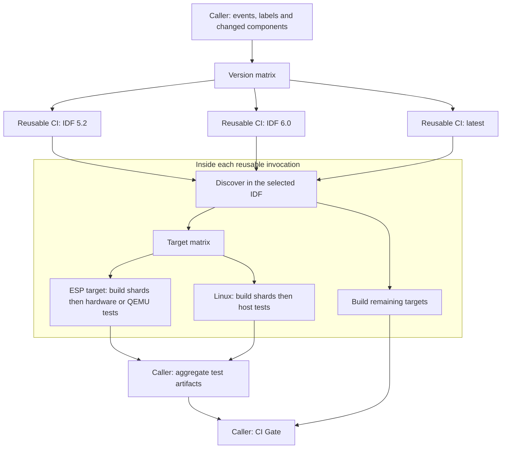

# CI in idf-extra-components

## Architecture

The caller chooses the ESP-IDF versions. The public
[reusable-ci.yml](workflows/reusable-ci.yml) executes a complete pipeline for
**one** version: discovery in that IDF environment, build shards, and tests.
It contains no release lists or special handling of `latest`.


```mermaid
flowchart TD
    caller[Caller: events, labels and changed components] --> versions[Version matrix]
    versions --> v52[Reusable CI: IDF 5.2]
    versions --> v60[Reusable CI: IDF 6.0]
    versions --> latest[Reusable CI: latest]
    subgraph one[Inside each reusable invocation]
        discover[Discover in the selected IDF] --> targets[Target matrix]
        targets --> esp[ESP target: build shards then hardware or QEMU tests]
        targets --> linux[Linux: build shards then host tests]
        discover --> extra[Build remaining targets]
    end
    v52 --> discover
    v60 --> discover
    latest --> discover
    esp --> report[Caller: aggregate test artifacts]
    linux --> report
    report --> gate[Caller: CI Gate]
    extra --> gate
```

[build_and_run_apps.yml](workflows/build_and_run_apps.yml) owns the PR, push
and schedule triggers, labels, component selection, reporting and stable
`CI Gate` status. Each target's tests wait only for that target's build
shards in its own IDF version. There is no cross-version matrix aggregation.

## Configuration and public inputs

Two project-owned files have separate responsibilities:

- [ci-matrix.json](ci-matrix.json): the caller's version matrix. Each entry
  contains an `idf_version` and a `test_profile`. This repository selects
  `no-linux-tests` for IDF 5.2 and 6.0; all other entries use `default`.
- [ci-config.json](ci-config.json): targets with individual build/test
  workers, runner mappings, shard limits and named profiles. A profile's
  `exclude_markers` disables those tests while retaining compile coverage.
  The planner handles all markers uniformly, including Ethernet and QEMU.

`reusable-ci.yml` accepts:

| Input | Default | Meaning |
| --- | --- | --- |
| `idf_version` | Required | Docker tag of `espressif/idf` |
| `config_file` | `.github/ci-config.json` | Project-owned runner and shard policy |
| `test_profile` | `default` | Named policy from that configuration |
| `run_tests` | `false` | Enable execution on the configured test runners |
| `modified_files` | `[]` | JSON array of changed file paths |
| `modified_components` | `[]` | JSON array of changed component names |
| `pipeline_id` | IDF version | Unique artifact namespace; override for repeated calls with the same version |

Empty selection arrays mean an unfiltered build. This repository's caller
uses [get_ci_changes.py](get_ci_changes.py) to select root-level components;
other repositories can provide their own selection data. The public workflow
does not accept shell fragments or require the caller to calculate shards.

The manifests and `.idf_build_apps.toml` remain in the project. They control
which apps and configurations are buildable in the current IDF. Discovery
sizes shards as `ceil(apps / runs_per_job)`, capped at `parallel_count`.
Changed-file/component filtering still happens at build time, so PRs may
need fewer nonempty shards than the full discovered inventory.

## Discovered test groups and runner requirements

`pytest_*.py` supplies target parameters and environment markers. Register
environment markers in `pytest.ini` under `env_markers`; ordinary markers
such as skip conditions are not runner requirements. No per-target
`test_configs` list is needed. For example, `quad_psram` on an ESP32-S3 test
automatically adds `esp32s3` and `quad_psram` to that group's runner labels.
Multiple environment markers stay together: `generic` plus `quad_psram`
is one group requiring both capabilities, not two independent test jobs.

The planner uses the pinned `idf-ci` collection API underlying `test collect`.
It preserves node IDs as JSON arrays (the CLI's GitHub formatter joins them
with spaces). Linux cases are collected with `--target linux` to preserve
the embedded-services parametrization used by their worker.

`runner_policy` in `ci-config.json` translates requirements into infrastructure:

- `default_labels` supplies `self-hosted`, `linux`, and `docker` once.
- `tag_aliases` translates individual tags; `generic: []` means the target
  label is sufficient on this repository's generic runners. Unmapped tags,
  including newly registered markers, pass through unchanged.
- `overrides` replaces specific target/marker tags for existing Ethernet
  and SPI NAND stations. Additional discovered requirements are retained.
- `environments` selects hardware, QEMU, or Linux-host execution. QEMU and
  Linux do not require a physical-device target label. QEMU retains the
  existing supported targets (`esp32s3`, `esp32c3`); an environment can
  restrict `targets`, override `labels`, and supply `pytest_args`.

Runner labels must describe actual available capabilities. The planner
does not query the GitHub runner fleet: a newly discovered marker schedules
its group, and GitHub waits for a runner matching all resolved labels.
Profiles can exclude a marker explicitly; this excludes the entire group
while preserving build coverage. Emulator cases keep their QEMU identity
even though idf-ci internally also marks them `host_test`.

Each group carries its exact `nodes`, resolved `runner_labels`, display
`marker`, `markers`, `pytest_args`, `setup_qemu`, and a stable `id`. The
worker first applies the existing build-metadata directory exclusions,
then a pytest collection hook selects only these node IDs. A broad `-m
generic` selection cannot accidentally run PSRAM tests on a generic runner.
Multi-DUT groups fail explicitly because the current worker restores and
executes a single target; they are not split into incomplete jobs.

## Calling from another repository

After publishing a CI revision, reference that revision from the caller.
Replace `YOUR_CI_COMMIT_SHA` below with the published commit:

```yaml
jobs:
  ci:
    strategy:
      fail-fast: false
      matrix:
        idf_version: [release-v5.4, release-v6.0]
    uses: espressif/idf-extra-components/.github/workflows/reusable-ci.yml@YOUR_CI_COMMIT_SHA
    with:
      idf_version: ${{ matrix.idf_version }}
      config_file: .github/ci-config.json
      run_tests: true
```

A single-version caller can omit `strategy` and pass one `idf_version`.
The consumer supplies its app manifests, pytest configuration and runner
policy, but does not copy CI scripts. Shared scripts and pinned tool
requirements are shipped in the [ci-tools action](actions/ci-tools/action.yml).

The first checkout retrieves the consumer's project. A second, sparse checkout
uses `job.workflow_repository` and `job.workflow_sha` to fetch only the CI
repository's `.github/actions/` directory into `.github/ci-source`. Local
action references then load those helpers at the exact workflow revision.
The consumer must reserve `.github/ci-source` for this checkout. Test containers
install Git when needed so checkout can use sparse Git operations.

Do not replace these references with `$/` or remote references to actions in
this repository: the runner stages the entire source archive before any
steps execute. Archives omit submodule contents, leaving links such as
`cbor/LICENSE -> tinycbor/LICENSE` dangling; runner staging then fails even
though the CI action does not use that file. Setting `submodules: true` on a
later checkout cannot fix a failure during action preparation.
See [the runner issue](https://github.com/actions/runner/issues/4626).

The workflow identity fields refer to the called workflow, unlike the
caller's `github.*` context. They are available on GitHub.com, not GitHub
Enterprise Server; GHES consumers need an explicit CI source repository/ref
contract. See [GitHub's job context documentation](https://docs.github.com/en/actions/reference/workflows-and-actions/contexts#example-usage-of-job-context-workflow-identity).

The internal [target worker](workflows/reusable-build-run-apps.yml) packages
runtime files using `build_info*.json`, preserving workspace-relative paths
and executable permissions in tar archives. It supports apps at the project
root and custom nested layouts. Artifacts are namespaced by pipeline ID,
target and shard; test reports add the stable group ID so combined markers
cannot collide. Custom build-directory conventions can be supplied through
the execution environment's `pytest_args`.

## Validation and remaining migration

Run the unit tests without installing ESP-IDF:

```sh
python3 -m unittest discover -s .github/tests -p 'test_*.py'
```

Run the planner inside each supported ESP-IDF image after sourcing its
`export.sh` and installing `actions/ci-tools/requirements.txt`:

```sh
GITHUB_OUTPUT=/tmp/ci.outputs python3 .github/actions/ci-tools/generate_build_matrix.py \
  --config .github/ci-config.json --profile default
```

Actionlint 1.7.12 does not yet recognize the documented workflow identity
properties on `job`. For that version, ignore only those property diagnostics:

```sh
actionlint -ignore '^property "workflow_(repository|sha)" is not defined in object type'
```

`CI Gate` fails on any failed or cancelled dependency and accepts intentional
skips. Build-only runs skip runtime artifacts and tests. PRs with no changed
component skip the version pipelines while still running unit tests and the
structural pytest/manifest check. Use `PR: test all apps` to exercise the
full pipeline for CI-only changes. Fork/Dependabot PRs keep test summaries
without requiring write access for checks or comments.

Build execution still uses `idf-build-apps`, with the existing build-info
selection for pytest. Moving to `idf-ci build run` is a separate step in
[PLAN.md](../PLAN.md), particularly default configuration directories and
component dependency mapping.
