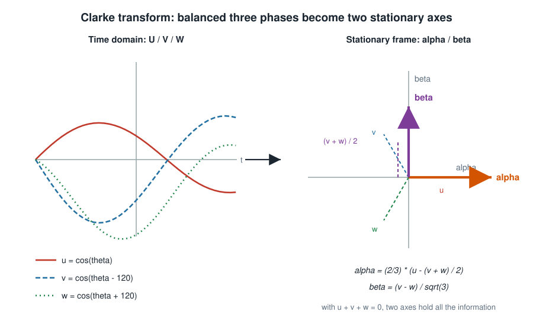
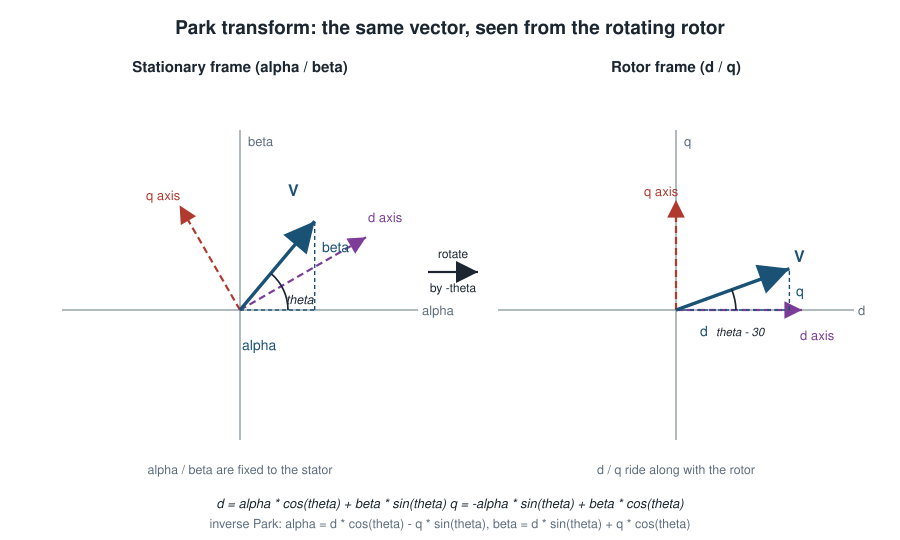

# Clarke Park Transform

Ever tried to control a brushless motor with three phase currents that all wiggle
sinusoidally at the electrical frequency? It is surprisingly painful: every
quantity you care about moves all the time, even when the machine runs at a
perfectly steady speed. The Clarke and Park transforms are the trick that turns
those three wiggling waves into two calm numbers a controller can actually work
with.

This component provides the four transforms, in `float` and in IQmath
fixed-point, behind one friendly API.

- `clarke_park_clarke()` / `clarke_park_iclarke()`: U/V/W <-> alpha/beta
- `clarke_park_park()` / `clarke_park_ipark()`: alpha/beta <-> d/q

## What the transforms actually do

### Clarke: three phases down to two axes

A balanced three-phase system has `u + v + w = 0`, so the third value is not
free: two numbers already hold everything. The Clarke transform projects the
three phase values onto two orthogonal axes fixed to the stator, called
`alpha` and `beta`.



Because the component uses the equal-amplitude convention, a phase amplitude of
`1` maps to a vector of length `1` in the alpha/beta plane - nice for control
loops where the amplitude is what you regulate.

### Park: follow the rotor, get nearly constant values

In the alpha/beta frame a steady motor still shows rotating vectors. The Park
transform expresses the same vector in a frame that is rotated by the rotor
electrical angle `theta`, so the two axes now spin with the rotor: `d` (direct,
along the rotor flux) and `q` (quadrature, 90 degrees ahead).



For a machine running at constant speed the `d` and `q` values become nearly
constant - which is exactly why field oriented control is built on top of these
two numbers.

### And back again

`clarke_park_iclarke()` and `clarke_park_ipark()` do the reverse, they are the
pieces a controller needs to turn its `d`/`q` commands back into phase voltages
for the inverter.

## Mathematical definitions

All transforms use the equal-amplitude convention (sometimes called the
amplitude-invariant Clarke transform): a phase peak amplitude of `1` produces a
vector of magnitude `1` in the alpha/beta plane. `theta` is the electrical angle
in radians, an `_iq` value in the fixed-point backend.

Clarke transform:

$$
\begin{aligned}
\alpha &= \tfrac{2}{3}\left(u - \tfrac{v+w}{2}\right) \\
\beta  &= \tfrac{1}{\sqrt{3}}\,(v - w)
\end{aligned}
$$

Inverse Clarke transform:

$$
\begin{aligned}
u &= \alpha \\
v &= \tfrac{1}{2}\left(\sqrt{3}\,\beta - \alpha\right) \\
w &= -u - v
\end{aligned}
$$

Park transform:

$$
\begin{aligned}
d &= \alpha \cos\theta + \beta \sin\theta \\
q &= -\alpha \sin\theta + \beta \cos\theta
\end{aligned}
$$

Inverse Park transform:

$$
\begin{aligned}
\alpha &= d \cos\theta - q \sin\theta \\
\beta  &= d \sin\theta + q \cos\theta
\end{aligned}
$$

## Add the component to your project

```bash
idf.py add-dependency "espressif/clarke_park"
```

## Using the component

One set of functions handles both numeric backends. You pick the backend by the
coordinate type you pass in, nothing else changes.

### Floating point

```c
#include "clarke_park.h"

void example(float theta_rad)
{
    clarke_park_uvw_f_t uvw = { .u = 1.0f, .v = -0.5f, .w = -0.5f };
    clarke_park_ab_f_t ab;
    clarke_park_dq_f_t dq;

    clarke_park_clarke(&uvw, &ab);        // U/V/W -> alpha/beta
    clarke_park_park(theta_rad, &ab, &dq); // alpha/beta -> d/q
}
```

### IQmath fixed point

Exactly the same calls, with the `_iq` coordinate types. The Q-format comes from
`CONFIG_CLARKE_PARK_IQ_FORMAT` and defaults to Q15.

```c
#include "clarke_park.h"

void example(_iq theta_rad)
{
    clarke_park_uvw_iq_t uvw = { .u = _IQ(1.0f), .v = _IQ(-0.5f), .w = _IQ(-0.5f) };
    clarke_park_ab_iq_t ab;
    clarke_park_dq_iq_t dq;

    clarke_park_clarke(&uvw, &ab);
    clarke_park_park(theta_rad, &ab, &dq);
}
```

### Mixing both backends

Both backends live in the same firmware and can be used side by side, for
example a float debug path next to the fixed-point control path. If you prefer
to be explicit, the suffixed functions (`clarke_park_clarke_f()`,
`clarke_park_park_iq()`, ...) are always available.

### The angle in the fixed-point backend

`theta` is an `_iq` value in radians. For Q15 the representable range is
`[-1, 1)`, so one electrical revolution does not fit into a single `_iq`
variable - reduce the angle to `[-pi, pi)` (or `[-1, 1)` rad for Q15) before
calling the transform, the same way you would for any other IQmath trigonometric
function.

## Choosing a Q-format

The Q-format is a compile time property: `CONFIG_CLARKE_PARK_IQ_FORMAT` is
applied as `GLOBAL_IQ` before IQmath is included.

| Format | Range | Resolution | When to use |
| --- | --- | --- | --- |
| Q15 | approx. +/- 1 | 3.1e-5 | Default. Matches the CORDIC hardware, best raw speed. |
| Q24 | approx. +/- 128 | 6.0e-8 | When you need precision over range. |
| Q8 | approx. +/- 128 | 3.9e-3 | Very large signals, coarse resolution. |

Q15 is the default because it is the format the CORDIC accelerator works in, so
the hardware path can be switched on without touching the numerics.

## CORDIC hardware acceleration

On chips with the CORDIC peripheral (currently ESP32-S3R)
`CONFIG_CLARKE_PARK_USE_CORDIC_HW` replaces the software `sin`/`cos` of the
fixed-point Park transform with the hardware unit.

- The hardware only supports Q15, so the option only takes effect with
  `CONFIG_CLARKE_PARK_IQ_FORMAT=15`. With any other format the component
  transparently falls back to the software IQmath implementation.
- The float backend is never affected.
- The transformations themselves (the multiply/accumulate part) are unchanged,
  only the trigonometric evaluation moves to hardware.

To know whether the hardware was really used, check the benchmark output or call
`clarke_park_cordic_init()` early and look for `ESP_ERR_NOT_FOUND` - it means the
CORDIC unit is already owned by someone else.

## Thread and ISR safety

| Transform | Thread safe | ISR safe |
| --- | --- | --- |
| Clarke / inverse Clarke | yes | yes |
| Park / inverse Park, software backend | yes | yes |
| Park / inverse Park, CORDIC backend | yes (serialized with a lock) | no |

The Clarke transforms are pure arithmetic, so they are safe anywhere. The CORDIC
engine is a single hardware unit and the driver is not reentrant on its own, so
the component serializes the hardware access with a lock. A side effect is that
the Park transforms must not be called from an ISR while a task may be using the
engine. Do the transforms in task context, or make sure the ISR and the tasks do
not overlap.

If another part of your application needs the CORDIC unit, share the handle with
`clarke_park_cordic_get_engine()` or release it with
`clarke_park_cordic_deinit()` instead of creating a second engine. See the
[API Reference](api.md) for the details.

## Accuracy

| Backend | Typical error |
| --- | --- |
| float | limited by `float` precision, about 1e-7 relative |
| IQmath Q24 | about 1e-6 absolute for values in +/-1 |
| IQmath Q15 | about 1e-4 absolute (quantization step 3.1e-5) |

## Real numbers

`examples/benchmark` counts the cycles of every transform on the target. Example
output on ESP32-S3R at 240 MHz, Q15 with the CORDIC hardware enabled:

```
clarke_iq                     11 cycles      45 ns
iclarke_iq                     9 cycles      37 ns
park_iq                       42 cycles     175 ns
ipark_iq                      44 cycles     183 ns
park_iq, IQmath sin/cos      280 cycles    1166 ns
```

The last line is the software reference: the difference is what the CORDIC
hardware saves. See the [benchmark example](https://github.com/espressif/idf-extra-components/tree/master/clarke_park/examples/benchmark)
for the full picture and the interpretation.

## Migrating from hand-written transforms

If you already have the classic formulas in your code, the move is mechanical:

- Replace the phase quantities with `clarke_park_uvw_*_t`, the alpha/beta pair
  with `clarke_park_ab_*_t` and the d/q pair with `clarke_park_dq_*_t`.
- Drop your `2/3`, `1/sqrt(3)` and `sqrt(3)` factors: they live in the
  component.
- For the fixed-point path, make sure `theta` is in `_iq` radians and inside the
  representable range of your Q-format.
