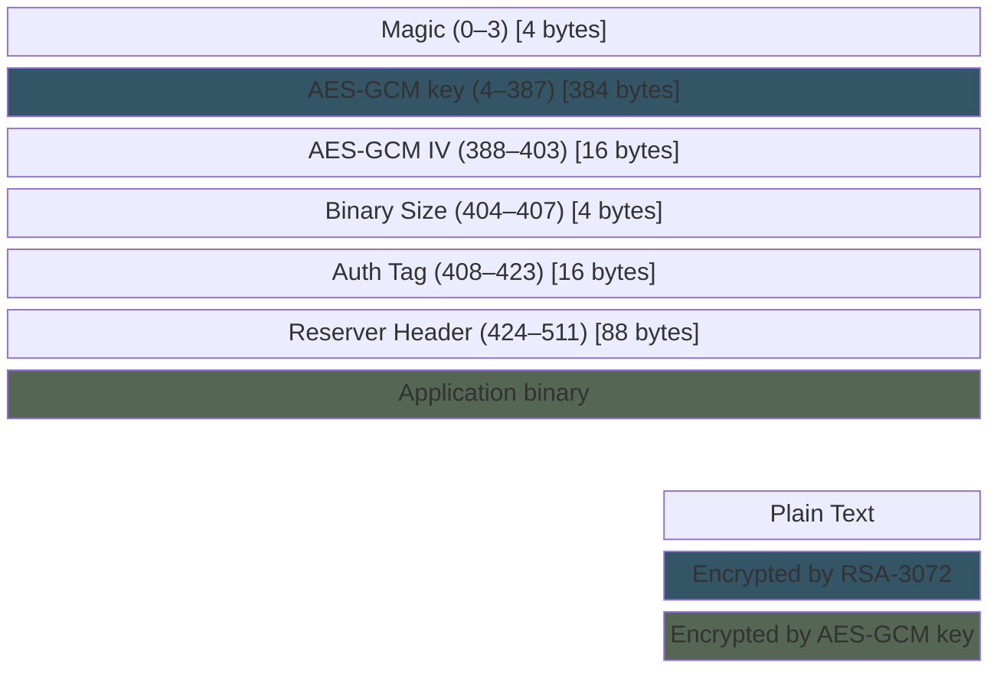
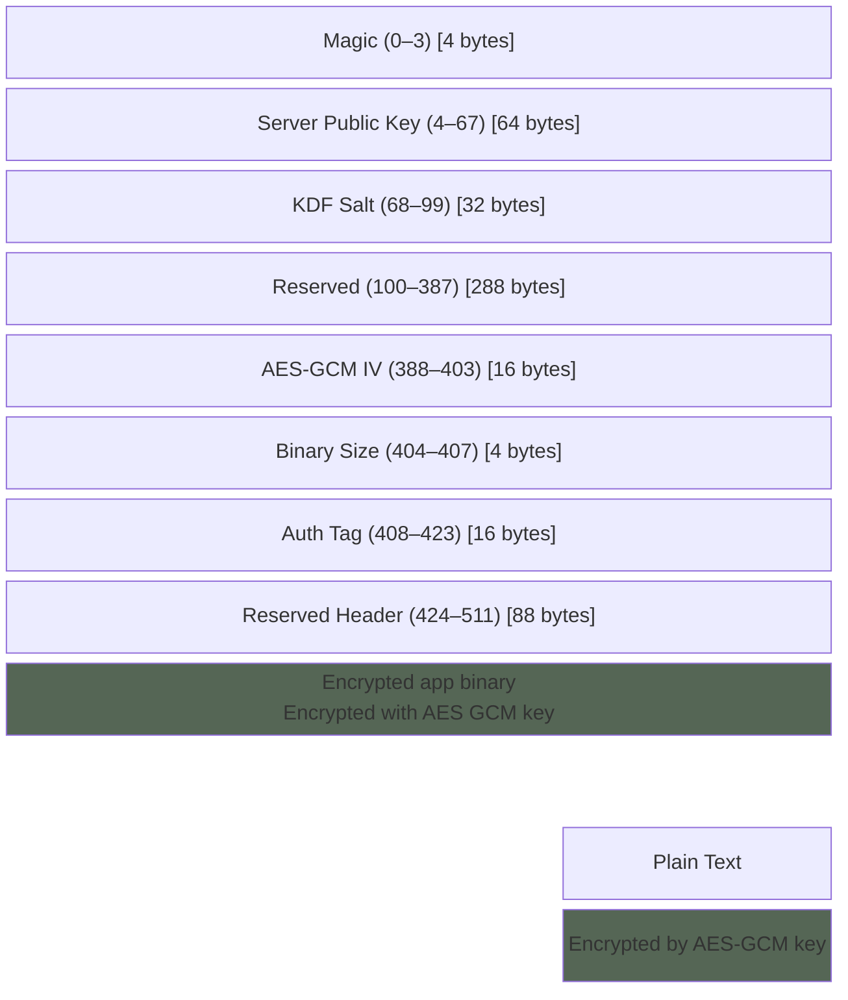

# ESP Encrypted Image Abstraction Layer

[](https://components.espressif.com/components/espressif/esp_encrypted_img)

This component provides an API interface to decrypt data defined in "ESP Encrypted Image" format. This format is as specified at [Image Format](#image-format)

This component can help in integrating pre encrypted firmware in over-the-air updates. Additionally, this component can also be used for other use-cases which requires addition of encryption layer for custom data.

## Image Format

The ESP Encrypted Image format supports two primary cryptographic schemes: RSA-3072 and ECIES-P256.

It consists of a header followed by the encrypted binary data. The total header size is 512 bytes for both RSA and ECIES-P256 schemes, but the internal layout of the header differs.

### RSA-3072 Image Header



The header for an image encrypted using the RSA-3072 scheme is structured as follows:

```c
typedef struct {
    uint8_t magic[4];             // Magic bytes (e.g., derived from SHA256("esp_encrypted_img"))
    uint8_t enc_gcm_key[384];     // AES-GCM key encrypted with RSA-3072 public key
    uint8_t iv[16];               // Initialization Vector for AES-GCM
    uint8_t bin_size[4];          // Size of the original binary (little-endian)
    uint8_t auth_tag[16];         // AES-GCM authentication tag
    uint8_t reserved_rsa[88];     // Reserved for future use
} esp_enc_img_rsa_header_t;
```

* **Magic (4 bytes):** Identifies the file type.
* **Encrypted GCM Key (384 bytes):** The 32-byte AES-GCM key, encrypted using the RSA-3072 public key (PKCS#1 v1.5 padding).
* **IV (16 bytes):** The Initialization Vector used for AES-GCM encryption.
* **Binary Size (4 bytes):** The size of the original, unencrypted binary data, in little-endian format.
* **Auth Tag (16 bytes):** The authentication tag generated by AES-GCM.
* **Reserved (88 bytes):** Padding to make the header 512 bytes.

### ECIES-P256 Image Header

The header for an image encrypted using the ECIES-P256 scheme is structured as follows:



```c
typedef struct {
    uint8_t magic[4];             // Magic bytes (e.g., derived from SHA256("esp_encrypted_img_ecc"))
    uint8_t server_pub_key[64];   // Server's uncompressed ECC public key (P-256, X and Y coordinates)
    uint8_t kdf_salt[32];         // Salt used for KDF (HKDF) to derive AES-GCM key
    uint8_t reserved_key_params[288]; // Reserved to make the key parameters block (server_pub_key, kdf_salt, this field) 384 bytes
    uint8_t iv[16];               // Initialization Vector for AES-GCM
    uint8_t bin_size[4];          // Size of the original binary (little-endian)
    uint8_t auth_tag[16];         // AES-GCM authentication tag
    uint8_t reserved_final_padding[88]; // Reserved padding to make the total header 512 bytes
} esp_enc_img_ecc_header_t;
```

* **Magic (4 bytes):** Identifies the file type.
* **Server Public Key (64 bytes):** The uncompressed public key of the server/script (P-256 curve). This consists of the X and Y coordinates (32 bytes each). This key is used by the device, along with its own private key, to perform ECDH and derive the shared secret.
* **KDF Salt (32 bytes):** The salt used with HKDF (based on SHA256) to derive the AES-GCM encryption key from the ECDH shared secret.
* **Reserved (288 bytes):** Padding to align the key parameters section (server public key, KDF salt, and this field) to 384 bytes so that the offset of the encryption-related parameters is unchanged.
* **AES-GCM IV (16 bytes):** The Initialization Vector used for AES-GCM encryption.
* **Binary Size (4 bytes):** The size of the original, unencrypted binary data, in little-endian format.
* **Auth Tag (16 bytes):** The authentication tag generated by AES-GCM.
* **Reserved Header (88 bytes):** Additional padding to ensure the total header size is 512 bytes.

The device's private key (required for ECDH on the device side) is typically derived on the device from an HMAC key. The `esp_enc_img_gen.py` script includes the *server's* public key in the header so the device can complete the ECDH handshake.

Note:

* RSA-3072 key is provided to the tool externally. You can generate an RSA key pair using the `esp_enc_img_gen.py` tool (recommended) or OpenSSL:
  * Using `esp_enc_img_gen.py`:
    ```bash
    python esp_enc_img_gen.py --generate_rsa_key
    ```
    This will create `rsa_pub_key.pem` and `rsa_priv_key.pem`.
  * Using OpenSSL:
    ```bash
    openssl genrsa -out rsa_key/private.pem 3072
    ```
* AES-GCM key and IV are generated by the tool itself.

### RSA with Digital Signature (DS) Peripheral

For ESP32 devices that support the Digital Signature peripheral (such as ESP32-S2, ESP32-S3, ESP32-C3, etc.), you can enable hardware-accelerated RSA operations by selecting the `PRE_ENCRYPTED_RSA_USE_DS` configuration option. This provides enhanced security and performance compared to software-based RSA operations.

**Configuration:**

In your project's menuconfig, navigate to:
```
Component config → Pre Encrypted OTA Configuration → Pre-encrypted OTA Scheme → RSA-3072 encryption → Use DS Peripheral
```

**Key Requirements:**

When using the DS peripheral, the RSA private key must be securely provisioned using the ESP Secure Certificate Manager. The key is stored in a special format that can only be used by the DS peripheral.

**Device Provisioning:**

Use the `configure_esp_secure_cert.py` tool to provision the DS context:

```bash
python configure_esp_secure_cert.py --target_chip <chip> --private-key <private_key.pem> --priv_key_algo RSA 3072 --configure_ds
```

This command generates the DS context and creates an `esp_secure_cert.bin` file that contains the encrypted private key and DS parameters.

**Partition Table Setup:**

Your project must include an `esp_secure_cert` partition in the partition table. The example project provides a reference partition table (`examples/pre_encrypted_ota/partitions.csv`) that includes:

```csv
esp_secure_cert,0x3F,,,0x2000,
```

You can use this as a template for your own project's partition table.

**Flashing the Secure Certificate:**

After generating the DS context, you must flash the `esp_secure_cert.bin` file to the device. You need to determine the correct partition offset first:

```bash
# Check your partition table to find the esp_secure_cert partition offset
idf.py partition-table

# Flash the secure certificate to the correct offset
esptool.py write_flash <esp_secure_cert_partition_offset> esp_secure_cert.bin
```

**Note:** Replace `<esp_secure_cert_partition_offset>` with the actual offset shown in your partition table output. For the example partition table provided, this is 0x9000, but always verify with your specific partition table.

Check the esp_secure_cert_manager documentation for more information on how to use the tool.

**Important Notes:**

- The DS peripheral requires the private key to be in a specific format managed by ESP Secure Certificate Manager
- Public key export via `esp_encrypted_img_export_public_key()` is not supported when using DS peripheral (returns `ESP_ERR_NOT_SUPPORTED`)
- This option is only available on ESP32 variants that support the Digital Signature peripheral
- Enhanced security as the private key never leaves the secure hardware peripheral
- The private key is stored securely in eFuse and cannot be read back in plaintext

## Tool Info

The `esp_encrypted_img` component includes a Python script, `esp_enc_img_gen.py`, designed for generating and managing encrypted images. This tool supports two primary cryptographic schemes for image encryption: RSA-3072 and ECIES-P256. The script requires a key file for all encryption and decryption operations. If keys are not available, they must be generated beforehand using the appropriate `--generate_..._key` options.

**Core Functionality:**

* **Encryption**: Secures binary files using either RSA or ECC. Requires a public key file.
* **Decryption**: Decrypts images. Requires the corresponding private key file.
* **Key Management**: Assists in generating cryptographic keys via `--generate_ecc_key` and `--generate_rsa_key` options.

### Key Generation

The tool provides options to generate cryptographic key pairs for both ECIES-P256 and RSA schemes.

* **Generate ECIES-P256 Key Pair**:
  Use the `--generate_ecc_key` option to generate an ECC key pair. This will create `device_pub_key.pem` (device public key) and `device_hmac_key.bin` (HMAC key for deriving device key).

  ```bash
  python esp_enc_img_gen.py --generate_ecc_key
  ```

* **Generate RSA Key Pair**:
  Use the `--generate_rsa_key` option to generate an RSA-3072 key pair. This will create `rsa_pub_key.pem` (public key) and `rsa_priv_key.pem` (private key).

  ```bash
  python esp_enc_img_gen.py --generate_rsa_key
  ```

### Encryption Schemes

#### 1. RSA-3072

This scheme uses an RSA public key to encrypt an AES-GCM key, which is then used to encrypt the image. The corresponding RSA private key is required for decryption.

**Key Generation:**

An RSA-3072 key pair (public and private keys) is required. You can generate one using OpenSSL or the tool itself:

Using OpenSSL:

```bash
openssl genrsa -out rsa_private_key.pem 3072
openssl rsa -in rsa_private_key.pem -pubout -out rsa_public_key.pem
```

Using the tool:

```bash
python esp_enc_img_gen.py --generate_rsa_key
```

This will create `rsa_pub_key.pem` and `rsa_priv_key.pem`.

* The `rsa_public_key.pem` is used for encryption.
* The `rsa_private_key.pem` is used for decryption.

**Encrypting the image:**

```bash
python esp_enc_img_gen.py encrypt <input_file.bin> /path/to/rsa_public_key.pem <output_encrypted.bin>
```

**Decrypting the image:**

```bash
python esp_enc_img_gen.py decrypt <output_encrypted.bin> <key_file.pem> <decrypted_output.bin>
```

#### 2. ECIES-P256

This scheme utilizes Elliptic Curve Cryptography (ECC) with a 256-bit curve. It employs an Elliptic Curve Diffie-Hellman (ECDH) key exchange to establish a shared secret. This shared secret is then used to derive an AES-GCM key for encrypting the image.
A device public key file must be provided for encryption. The script will then generate an ephemeral server key pair for the ECDH process, and the server's public key is included in the image header. This allows the device (which possesses the corresponding device private key) to reconstruct the shared secret and decrypt the image.

**General Encryption Command Structure:**

```bash
python esp_enc_img_gen.py encrypt <input_file.bin> <path_to_device_public_key.pem> <output_encrypted.bin>
```

**Key Generation and Management Files (ECIES-P256):**

During ECIES-P256 encryption, various key-related files may be generated or used by the script:

* `device_hmac_key.bin`: An HMAC key used to derive the device's ECC key pair. This file is saved if an HMAC key is generated by `--generate_ecc_key`.
* `device_pub_key.pem`: The device's public ECC key (in PEM format). This is generated by `--generate_ecc_key` or can be provided by the user.
* The server's public ECC key is generated by the script during encryption and included in the encrypted image header. It is not saved as a separate file.

**Device Provisioning for ECIES-P256 with HMAC Key (Example: `pre_encrypted_ota`)**

When using an HMAC-derived device key for ECIES-P256, the device hmac key must be securely provisioned onto the device. This is typically done by burning it into an eFuse key block.

1. **Burn the HMAC Key to eFuse:**

    Use the `idf.py` command to burn the `device_hmac_key.bin` to a specific eFuse key block. For example:

    ```bash
    idf.py efuse-burn-key BLOCK_KEY<N> device_hmac_key.bin HMAC_UP
    ```

    Replace `BLOCK_KEY<N>` with the actual eFuse block you intend to use (e.g., `BLOCK_KEY0`, `BLOCK_KEY1`, etc., up to `BLOCK_KEY5` typically).

2. **Code Configuration:**

    The eFuse block chosen in the command above must match the HMAC key ID used in your application code. In the `pre_encrypted_ota` example, the HMAC key ID is defined in the source code and should be updated to match your chosen eFuse block.

    ```c
    #define HMAC_UP_KEY_ID 2
    esp_decrypt_cfg_t cfg = {
        .hmac_key_id = HMAC_UP_KEY_ID,
    };
    ```

**Selecting OTA Scheme in Example:**

The `pre_encrypted_ota` example project uses Kconfig options to allow selection between RSA and ECIES-P256 schemes for OTA updates:

* `PRE_ENCRYPTED_OTA_SCHEME`: This choice allows you to select either:
* `PRE_ENCRYPTED_OTA_USE_RSA`: For RSA-based pre-encrypted OTA.
* `PRE_ENCRYPTED_OTA_USE_ECIES`: For ECC-based pre-encrypted OTA.

Make sure these configurations are set correctly in your project's configuration to match your chosen encryption scheme and hardware provisioning.

### ECC-256 Encryption Use Cases

* **Use Case 1: No Pre-existing Device Keys**
  If you do not have existing ECC keys for the device, you must first generate them. The `--generate_ecc_key` option will create a device HMAC key (`device_hmac_key.bin`) and a device public key (`device_pub_key.pem`) derived from it. The `device_pub_key.pem` is then used for encryption.

  1. Generate the necessary keys:

     ```bash
     python esp_enc_img_gen.py --generate_ecc_key
     ```

     This command creates `device_hmac_key.bin` and `device_pub_key.pem` in the current directory.

  2. Encrypt the image using the generated device public key:

     ```bash
     python esp_enc_img_gen.py encrypt <input_file.bin> device_pub_key.pem <output_encrypted.bin>
     ```

* **Use Case 2: Pre-existing Device Public Key is Available**
    Uses a provided device public ECC key (e.g., `device_pub_key.pem`) directly. The script will use this key and generate a new server key pair for ECDH.

    ```bash
    python esp_enc_img_gen.py encrypt <input_file.bin> <path_to_your_device_public_key.pem> <output_encrypted.bin>
    ```

    The public key of the ephemeral server key pair used for ECDH is embedded in the image but not saved to a separate file.

## Per Device Unique Key Support

The `esp_encrypted_img` component supports workflows where each device is provisioned with a unique key pair. This is essential for scenarios requiring per-device image encryption and secure provisioning. By exporting the public key from the device or key management system, you can automate image generation and ensure that only the intended device can decrypt its firmware or data.

It is the application's responsibility to:
- Generate the key using a good entropy source (the [ESP-IDF Random Number Generation APIs](https://docs.espressif.com/projects/esp-idf/en/latest/esp32/api-reference/system/random.html) provide suggested approach using ESP-IDF APIs).
- Flash the generated key to the device securely (e.g., to eFuse or in Flash).
- Retrieve the public key (using the API below), send it to the server, and use it to generate pre-encrypted OTA binaries for each device.

<details>
<summary>How to Export the Public Key</summary>

### Exporting the Public Key Programmatically

The component provides an API to retrieve the public key associated with the decryption context:

```c
/**
 * @brief  Export the public key corresponding to the private key.
 *         The application should free the memory pointed by `pub_key` after use.
 *         For RSA, the public key is in DER format and corresponds to the private key passed with `esp_encrypted_img_decrypt_start()`.
 *         For ECIES, the public key is in DER format and is derived from the HMAC key ID passed with `esp_encrypted_img_decrypt_start()`.
 *
 * @param ctx   esp_decrypt_handle_t handle
 * @param pub_key   Pointer to store the public key
 * @param pub_key_len   Pointer to store the length of the public key
 * @return esp_err_t   Status of the operation
 */
esp_err_t esp_encrypted_img_export_public_key(esp_decrypt_handle_t ctx, uint8_t **pub_key, size_t *pub_key_len);
```

- **RSA-3072:** Returns the public key in DER format.
- **ECIES-P256:** Returns the public key in DER format and is derived from the HMAC key ID.

</details>

### Getting More Help

To explore all available options and commands for the tool, use:

```bash
python esp_enc_img_gen.py --help
```

## API Reference

To learn more about how to use this component, please check API Documentation from header file [esp_encrypted_img.h](https://github.com/espressif/idf-extra-components/blob/master/esp_encrypted_img/include/esp_encrypted_img.h)
