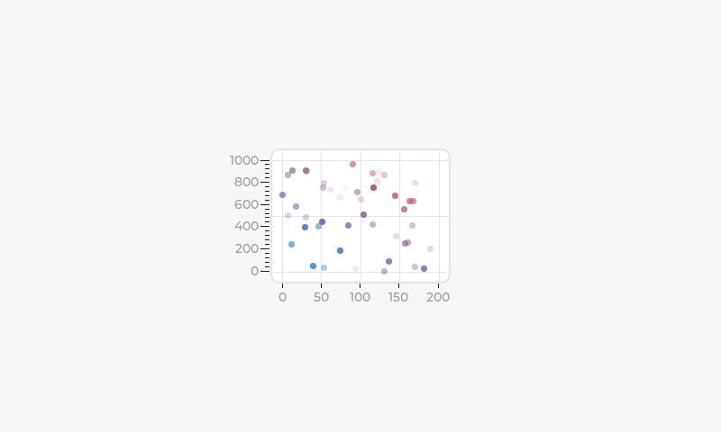

# QEMU RGB Panel

This example demonstrates how to use the virtual QEMU RGB panel. In this case, LVGL uses the virtual panel to render its graphical user interface.

The frame buffer can be chosen between internal RAM or dedicated frame buffer.

## How to Use Example

### Hardware Required

* No hardware target is required to run this example

### Configure the Example

By default, the example will use the target internal RAM as the frame buffer. To utilize the QEMU dedicated frame buffer, enable the option `Use QEMU RGB panel dedicated framebuffer` within the `menuconfig`.

### Build and run

To build and run the example, run:
```shell
idf.py qemu -g monitor
```

Please refer to the [QEMU Guide](https://github.com/espressif/esp-toolchain-docs/blob/main/qemu/README.md) for more information on installing and running QEMU.

## Example Output

```text
I (55) example: Install RGB LCD panel driver
I (55) example: Initialize RGB LCD panel
I (55) example: Initialize LVGL library
I (55) example: Allocate separate LVGL draw buffer
I (55) example: Register display driver to LVGL
I (55) example: Install LVGL tick timer
I (55) example: Create LVGL task
I (55) example: Starting LVGL task
I (65) example: Display LVGL Scatter Chart
I (75) main_task: Returned from app_main()
```

The following image should be displayed:

