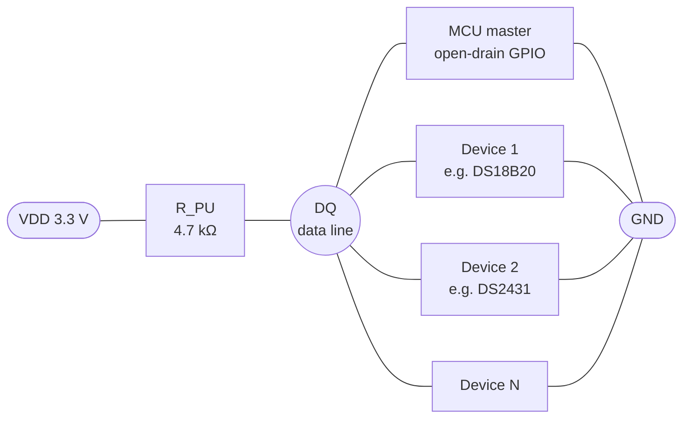
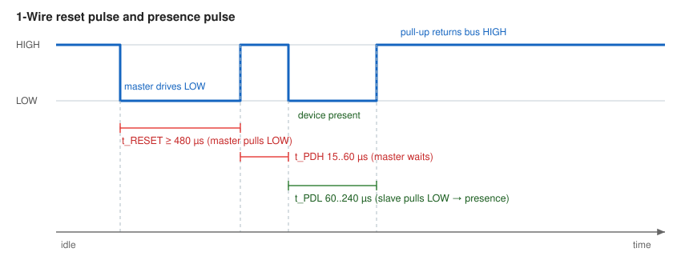
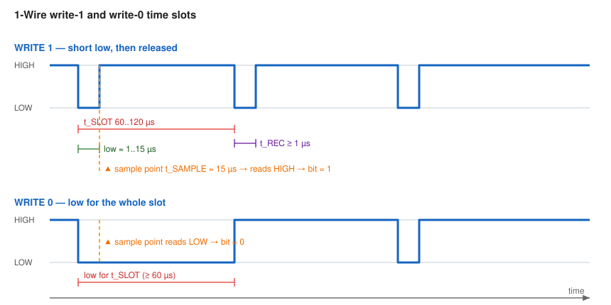
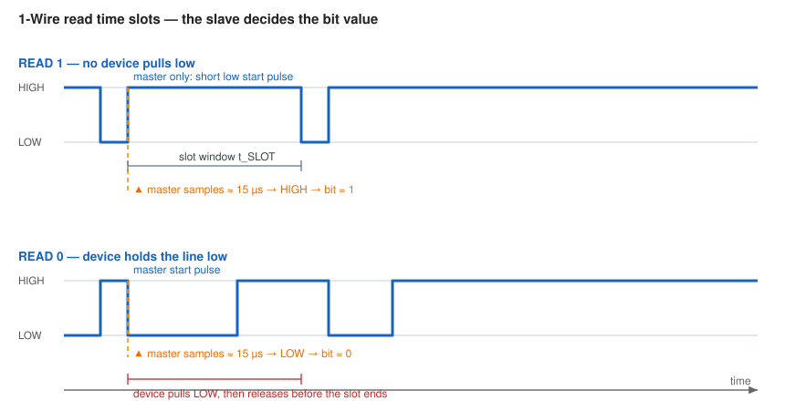
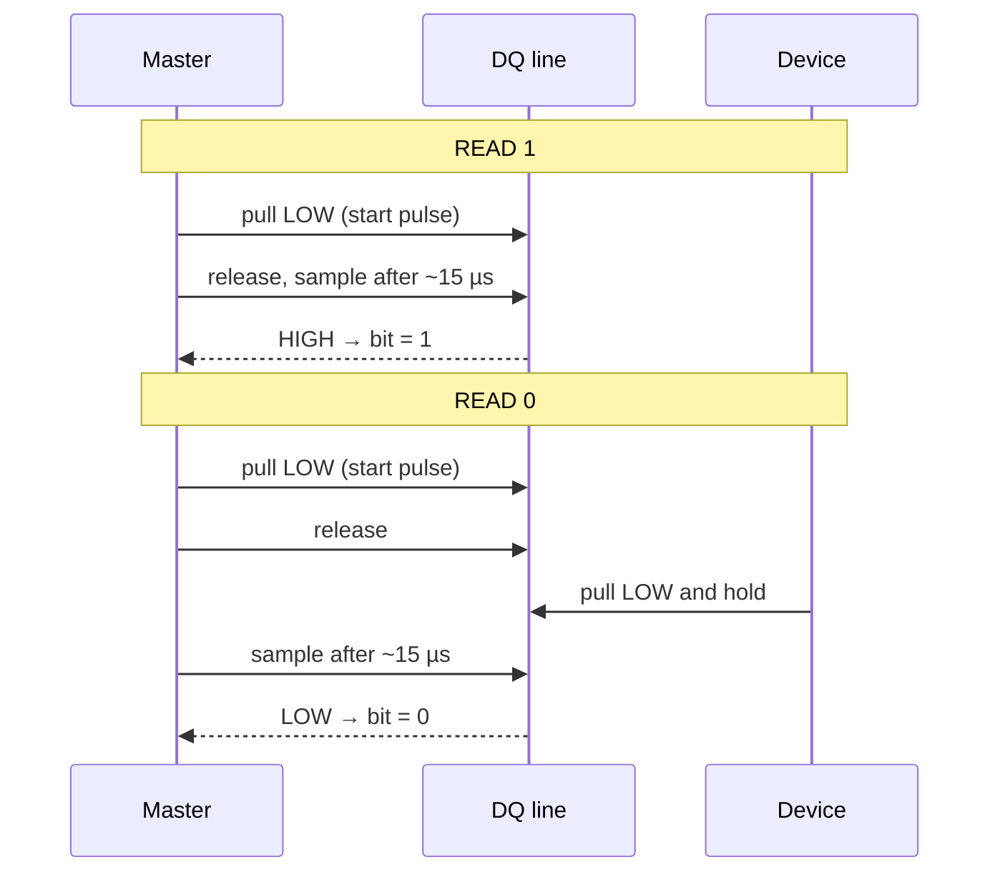
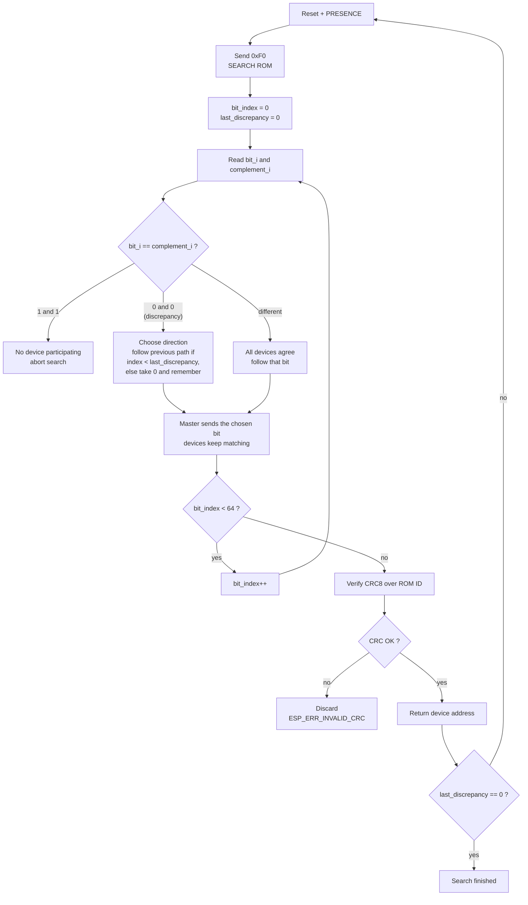
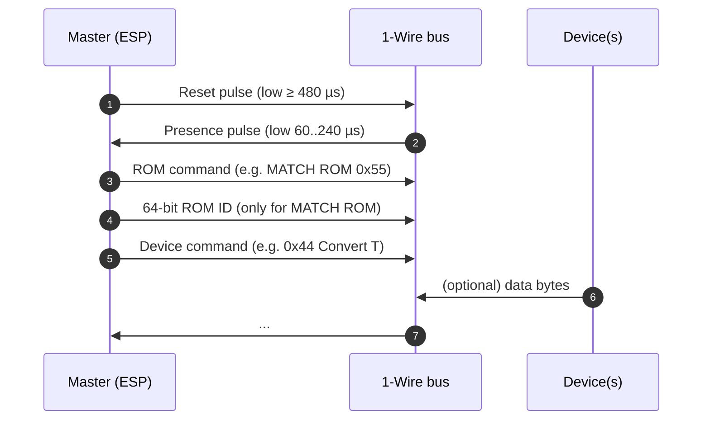
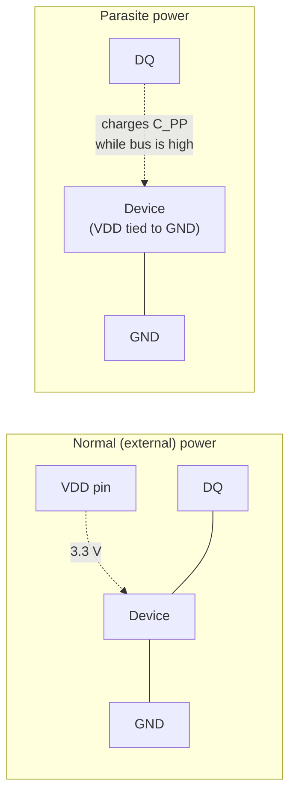
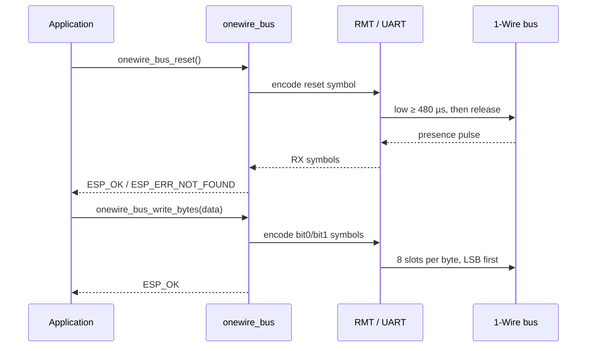

# 1-Wire Bus Basics

> This chapter explains **how the 1-Wire bus works on the wire**: the electrical structure, the timing of every signalling primitive, how devices are discovered, how data is protected and how devices can even be powered over the same single wire. Read it once and the whole API will feel obvious.

## Why "1-Wire"?

A 1-Wire bus needs only **two** conductors: one **data line (DQ)** and one
**ground (GND)**. There is no separate clock line, no chip-select line and no
address lines. Everything — reset, addressing, commands, data and even power — travels over that single data line.

That is remarkable, and it is only possible because of three design decisions:

1. **All drivers are open-drain.** Every device can only pull the line *low*; the line is released to *high* by a single pull-up resistor. So the bus is a "wired-AND": the line is high only when *nobody* pulls it low.
2. **The master is the clock.** Because there is no clock line, the master defines time by generating low pulses of a defined width. Devices recover the clock by observing these pulses.
3. **Every bit is a time slot.** A bit is not a level, it is a *timing shape*: the same start pulse is followed by either a short or a long low phase to encode `1` or `0`.

The bus is **single-master**: one master (your ESP chip) and one or more slaves (sensors, EEPROMs, ...). Slaves never start a transfer on their own — they only answer inside the time slots the master creates.

## Electrical Structure

The data line is driven by open-drain (or tri-state) outputs and held high by a single pull-up resistor, typically **4.7 kΩ** to 3.3 V:

Because the outputs are open-drain, **low wins**: if any participant pulls the line low, the whole line reads low. This is what makes multi-drop communication, device-presence detection and collision detection possible.

The idle state of the bus is **high** (released). A transfer always begins with the master pulling the line low.

### Choosing the pull-up resistor

The pull-up has to do two jobs: pull the bus high *fast enough* (the RC time constant with the bus capacitance must be much shorter than a time slot) and supply the bus while a device answers.

| Pull-up | Behaviour |
|---------|-----------|
| No pull-up (or MCU internal pull-up, ≈45 kΩ) | Slow rising edges, unreliable slots, may still work on very short wires. Not recommended. |
| **4.7 kΩ (recommended)** | Good compromise for a few metres of cable and a handful of devices. |
| 1 kΩ .. 2.2 kΩ | Use for long cables, many devices or high bus capacitance. Increases current draw when the bus is low. |
| Active pull-up (strong pull-up on a transistor) | Required for **parasite power** operations such as temperature conversion. |

> **💡 Tip**
>
> ESP-IDF internal pull-up is roughly 45 kΩ. It is useful only as a fallback. Always place an external 4.7 kΩ resistor close to the master end of the cable.

## Timing: Four Building Blocks

The 1-Wire protocol defines exactly **four** low-level operations. Everything else (ROM commands, device commands, memory reads) is built from these:

| Operation | Generated by | Purpose |
|-----------|--------------|---------|
| **Reset / Presence** | master | Bring all devices to a known state and detect whether any device answers. |
| **Write 0 / Write 1** | master | Send one bit to every device. |
| **Read** | master + slave | Master starts the slot, the *slave* decides whether the line stays low long. |

The timing values below are the classic "standard speed" numbers from the Maxim data sheets (and the ones used by this driver):

| Symbol | Meaning | Value |
|--------|---------|-------|
| `t_RESET` | Master reset low time | ≥ 480 µs |
| `t_PDH` | Presence-detect high time before devices answer | 15 .. 60 µs |
| `t_PDL` | Presence-detect low time (device pulls low) | 60 .. 240 µs |
| `t_SLOT` | One bit slot | 60 .. 120 µs |
| `t_REC` | Recovery time between slots | ≥ 1 µs (≥ 10 µs with parasite power) |
| `t_SAMPLE` | Master sample point inside a read slot | within 15 µs from slot start |

> **📝 Note**
>
> The driver in this component works at the **standard speed** of the 1-Wire protocol. Overdrive speed is not supported.
>
> For reference, the RMT backend uses the following constants (microseconds): 2 µs slot start pulse, 60 µs bit duration, 5 µs recovery time and a 15 µs sample point, plus a 500 µs reset pulse. The UART backend emulates the same timing by switching between 9600 baud (reset) and 115200 baud (slots).

### Master Reset & Slave Presence

Before *every* transaction the master must reset the bus. The reset pulse synchronises all devices; the presence pulse tells the master that at least one device is really there.

Reading the diagram, step by step:

1. The bus idles **high**.
2. The master pulls the line **low for at least 480 µs** — this is the *reset pulse*. All devices see it and prepare to answer.
3. The master releases the line; the pull-up brings it high. The master now waits (and keeps sampling) for `t_PDH` (15 .. 60 µs).
4. If a device is present, it pulls the line **low for 60 .. 240 µs** — this is the *presence pulse*.
5. The bus returns high and is ready for the next operation.

Because every device answers the reset *at the same time*, the presence pulse is a **wired-AND**: presence is detected, but *not* how many devices answered. To find out *who* is on the bus, see [Device Discovery: the ROM Search](#device-discovery).

### Write Time Slots

To write a bit, the master pulls the line low (this edge starts the slot) and then either releases it quickly (`1`) or keeps it low (`0`).

* **Write 1**: low for ≈ 1 .. 15 µs, then released. The slave samples the line at `t_SAMPLE` (≈ 15 µs) and sees a **high** level → it latches `1`.
* **Write 0**: low for the whole slot (≥ 60 µs). The slave samples at `t_SAMPLE` and sees **low** → it latches `0`.
* After the slot the master must leave at least `t_REC` of recovery time before the next slot.

### Read Time Slots

A read is a write slot whose outcome the **slave** decides. The master only generates the start pulse; whether the sampled level is high or low depends on whether any device holds the line low.

* **Read 1**: the master pulls the line low briefly and releases it. Nobody pulls it down afterwards, so at the sample point (~15 µs) the master reads **high** → bit = `1`.
* **Read 0**: the master starts the slot exactly the same way, but the device pulls the line **low** for the remainder of the slot. The master reads **low** at the sample point → bit = `0`.
* The master must always generate the start edge, even though it is only listening. That is how the device knows *when* to answer.

## Device Discovery: the ROM Search

Every 1-Wire device has a **globally unique 64-bit ROM ID** burned in at manufacture:

| Byte(s) | Content |
|---------|---------|
| 0 | **Family code** — device type (e.g. `0x28` = DS18B20, `0x01` = DS2431) |
| 1 .. 6 | **Serial number** — unique per device |
| 7 | **CRC8** of bytes 0 .. 6 |

The ROM ID is the "address" of a device. The driver exposes it as `onewire_device_address_t`, and `onewire_new_device_iter()` / `onewire_device_iter_get_next()` implement the search.

### The problem

The master cannot ask "who are you?" one by one, because a new device does not know its own index. With multiple devices on the bus the master must instead run the classic **binary tree search**: it sends one ROM bit position at a time and lets the devices reveal their bits.

The trick: at every bit position each device sends **the bit and its complement**. So:

* If all devices have the same bit value, the master reads *different* values for bit and complement. No branch → continue.
* If devices disagree on that bit, the master reads `0` *and* `0` (because the wired-AND of "bit" and "complement" is `0` for both groups). This is a **discrepancy** — the tree branches here.
* If no device is present at all, both reads return `1` — an error/end condition.

The master picks `0` first (recording the branch position), walks down the tree, and in the next iteration re-enters at the recorded discrepancy taking `1` instead. After about `log2(N)` extra passes, all `N` devices were enumerated.

For a full walk-through with a worked example, see Maxim's application note
*"1-Wire Search Algorithm"* (linked at the bottom of this page).

## Addressing: ROM Commands

Once the reset is acknowledged, the master sends a **ROM command** which selects *which* device(s) will listen to the following device-specific command:

| ROM command | Value | Meaning |
|-------------|-------|---------|
| `SEARCH ROM` | `0xF0` | Start/continue the ROM search (see above). |
| `MATCH ROM` | `0x55` | Followed by a 64-bit ROM ID: only that device listens. Use this when several devices share the bus. |
| `SKIP ROM` | `0xCC` | All devices listen — convenient when only **one** device is on the bus. |
| `SEARCH ALARM` | `0xEC` | Search only devices that flag an alarm condition. |
| `READ POWER SUPPLY` | `0xB4` | Ask devices whether they use parasite power. |

A complete transaction therefore looks like this:

## Data Transfer and CRC8

Within a device transaction, bytes are transferred **LSB first**: the least significant bit of every byte goes on the bus first, and for multi-byte values the least significant byte goes first as well.

Errors are caught with a **CRC8** using the Dallas polynomial `x⁸ + x⁵ + x⁴ + 1` (`0x8C` reflected). Many devices append the CRC of their ROM ID and of the data they return; `onewire_crc8()` in this component lets you verify it. If you feed the payload *including* the transmitted CRC, a correct frame yields **0**, which makes the check a simple `crc == 0`.

> **💡 Tip**
>
> Always verify the CRC of data you read back, especially for long cables or noisy environments. A CRC mismatch is the cheapest possible error detector.

## Parasite Power

1-Wire devices need energy. Two powering schemes exist:

* **Normal power**: the device has its own VDD pin. The longer the master keeps a slot low, the longer the device is unpowered — but it survives because of its internal capacitor.
* **Parasite power**: VDD is tied to GND and the device steals power from the data line into an internal capacitor `C_PP` whenever the bus is high. This saves a wire, but during power-hungry operations (e.g. a temperature conversion) the device must be *actively* powered by holding the bus high.

Two practical consequences:

1. In parasite mode the recovery time `t_REC` between slots must be larger (the standard asks for ≥ 10 µs) so the capacitor can recharge.
2. The master should use a **strong pull-up** (an actively driven transistor to VDD) during long conversions instead of the 4.7 kΩ resistor, which cannot supply enough current.

This driver does not implement an active strong pull-up; use it with externally powered devices, or drive your own strong pull-up GPIO if you need parasite power.

## Why a 1-Wire Driver Needs a Peripheral to Generate It

A 1-Wire bit is only 60 µs long, and the sample point is ~15 µs after the slot start. Generating and sampling such short pulses from a FreeRTOS task is unreliable, especially for the ROM search (which requires a read immediately after every write, 64 times in a row).

This component therefore never bit-bangs the bus. It uses a hardware backend that produces and captures the pulses for you:

* **RMT backend** (`onewire_new_bus_rmt`, recommended) — uses an RMT TX/RX channel pair on one GPIO. The TX channel is loaded with pre-computed symbol sequences (`bit0` / `bit1` waveforms and the reset pulse), and the RX channel captures the actual waveform so the driver can measure the low phase and decide whether a `1` or a `0` was returned.
* **UART backend** (`onewire_new_bus_uart`) — abuses a UART in 8N1 open-drain mode: the 1-Wire slot and reset pulses are emulated with TX bytes (`0xF0` for reset, `0x00`/`0xFF` for write bits, `0xFF` for read slots) at two different baud rates. Useful when no RMT channel is free.

With either backend, `onewire_bus_write_bit()` / `onewire_bus_read_bit()` / `onewire_bus_write_bytes()` / `onewire_bus_read_bytes()` block until the hardware has finished.

## Further Reading

* Maxim / Analog Devices: [1-Wire search algorithm](https://www.analog.com/en/app-notes/1wire-search-algorithm.html)
* Maxim / Analog Devices: [Using a UART to implement a 1-Wire bus master](https://www.analog.com/en/resources/technical-articles/using-a-uart-to-implement-a-1wire-bus-master.html)
* Maxim / Analog Devices: [1-Wire timing and definition of terms](https://www.analog.com/en/resources/technical-articles/1wire-timing.html)
