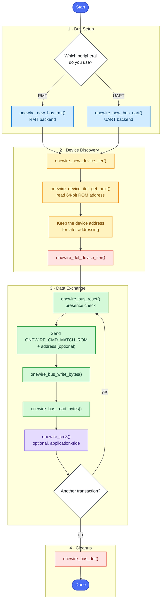

# 1-Wire Bus Programming Guide

The 1-Wire bus driver provides a generic interface for communicating with Dallas/Maxim 1-Wire devices on ESP chips. It hides the low-level timing requirements of the protocol behind a small, backend-agnostic API.

The documentation is split into two parts:

- **[1-Wire Bus Basics](1-wire-basics.md)** — how the bus actually works: electrical structure, reset/presence, read/write time slots, ROM search, CRC8 and parasite power. Read this first; it makes every API call obvious.
- **[Quick Start Guide](quick-start.md)** — the step-by-step recipe for using the component: create a bus, discover devices, talk to them, verify data and release resources.

## Overview

1-Wire is a device communications bus system that uses a single data line plus ground for communication — no separate clock line. Common 1-Wire devices include temperature sensors (DS18B20), EEPROMs (DS2431) and real-time clocks (DS2417).

This driver provides:

- Automatic 1-Wire bus initialization with an RMT or UART backend
- Device discovery and enumeration on the bus
- Read/write operations at bit and byte level
- Built-in CRC8 calculation for data integrity
- Support for multiple devices on a single bus

## API Usage Workflow

The diagram below shows the typical lifecycle of an application built on the 1-Wire bus driver. Each color highlights a different stage of the workflow: **bus setup**, **device discovery**, **data exchange**, and **resource cleanup**. Discovery can end as soon as ROM addresses are saved; data exchange may then repeat until the application is finished with the bus.




## Add the Component to Your Project

Add the `onewire_bus` component to your project via the ESP Component Registry:

```bash
idf.py add-dependency "espressif/onewire_bus"
```

Then continue with the [Quick Start Guide](quick-start.md), or dive straight into the [1-Wire Bus Basics](1-wire-basics.md) chapter if you want to understand what happens on the wire first.

## Where to Go Next

- **[1-Wire Bus Basics](1-wire-basics.md)** — protocol principles, timing diagrams, ROM search, CRC8, parasite power and how the ESP backends generate the waveforms.
- **[Quick Start Guide](quick-start.md)** — bus creation, device enumeration, reads/writes and CRC verification with complete code snippets.
- **[API Reference](api.md)** — generated reference for every public function, type and macro.
