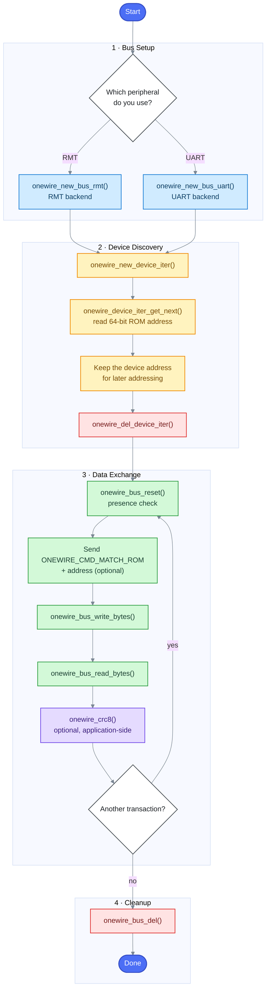
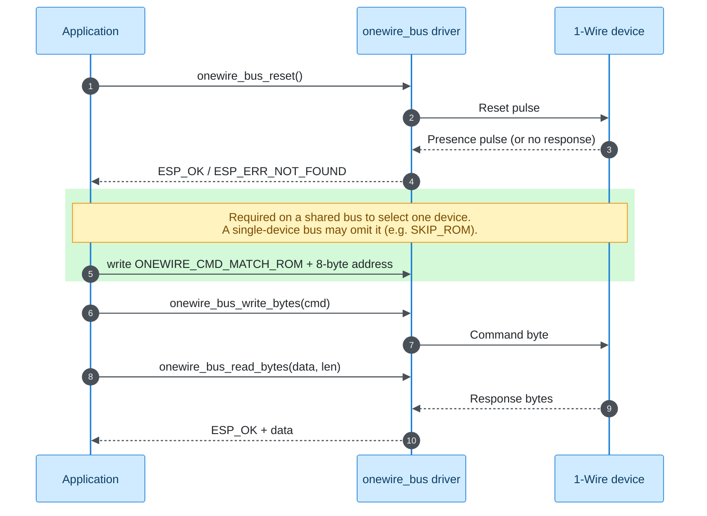

# 1-Wire Bus Programming Guide

The 1-Wire bus driver provides a generic interface for communicating with Dallas/Maxim 1-Wire devices. It supports multiple hardware backends (RMT and UART) and handles the low-level timing requirements of the 1-Wire protocol automatically.

## Overview

1-Wire is a device communications bus system that uses a single data line plus ground for communication. Common 1-Wire devices include temperature sensors (DS18B20), EEPROMs (DS2431), and real-time clocks (DS2417).

This driver provides:
- Automatic 1-Wire bus initialization with RMT or UART backend
- Device discovery and enumeration on the bus
- Read/write operations at bit and byte level
- Built-in CRC8 calculation for data integrity

## API Usage Workflow

The diagram below shows the typical lifecycle of an application built on the 1-Wire bus driver. Each color highlights a different stage of the workflow: **bus setup**, **device discovery**, **data exchange**, and **resource cleanup**. Discovery can end as soon as ROM addresses are saved; data exchange may then repeat until the application is finished with the bus.




## Add the Component to Your Project

Add the `onewire_bus` component to your project via the ESP Component Registry:

```bash
idf.py add-dependency "espressif/onewire_bus"
```

## Allocate 1-Wire Bus with RMT Backend

The RMT backend is the recommended approach for most ESP32 chips that support the RMT peripheral and have free RMT channels. Create the bus with [onewire_new_bus_rmt](api.md#function-onewire_new_bus_rmt).

```c
#include "onewire_bus.h"

// 1-Wire bus configuration
onewire_bus_config_t bus_config = {
    .bus_gpio_num = 4,              // GPIO pin connected to the 1-Wire bus data line
    .flags = {
        .en_pull_up = false,        // Set true to enable internal pull-up (external pull-up recommended)
    }
};

// RMT backend specific configuration
onewire_bus_rmt_config_t rmt_config = {
    .max_rx_bytes = 10,             // Maximum bytes expected in a single receive operation
};

// Create the 1-Wire bus handle
onewire_bus_handle_t bus = NULL;
ESP_ERROR_CHECK(onewire_new_bus_rmt(&bus_config, &rmt_config, &bus));
```

### Notes on RMT Backend

- The RMT backend uses a pair of RMT TX and RX channels internally
- The `max_rx_bytes` member of [onewire_bus_rmt_config_t](api.md#struct-onewire_bus_rmt_config_t) determines the size of the internal receive buffer. Set this based on the maximum response size you expect from your devices
- An external 4.7kΩ pull-up resistor is recommended for reliable communication, especially when multiple devices are on the bus or cable lengths are long

## Allocate 1-Wire Bus with UART Backend

The UART backend is an alternative that uses the UART peripheral with open-drain configuration. This is useful when RMT channels are not available. Create the bus with [onewire_new_bus_uart](api.md#function-onewire_new_bus_uart).

```c
#include "onewire_bus.h"

// 1-Wire bus configuration
onewire_bus_config_t bus_config = {
    .bus_gpio_num = 4,              // GPIO pin connected to the 1-Wire bus data line
    .flags = {
        .en_pull_up = false,        // Set true to enable internal pull-up (external pull-up recommended)
    }
};

// UART backend specific configuration
onewire_bus_uart_config_t uart_config = {
    .uart_port_num = 1,             // UART port number to use
};

// Create the 1-Wire bus handle
onewire_bus_handle_t bus = NULL;
ESP_ERROR_CHECK(onewire_new_bus_uart(&bus_config, &uart_config, &bus));
```

### Notes on UART Backend

- Both the UART TX and RX paths are configured to the same GPIO pin (`bus_gpio_num` in [onewire_bus_config_t](api.md#struct-onewire_bus_config_t))
- The GPIO is automatically configured as open-drain mode

## Enumerate Devices on the Bus

After initializing the bus, you can discover all 1-Wire devices connected to it with [onewire_new_device_iter](api.md#function-onewire_new_device_iter). Each 1-Wire device has a unique 64-bit ROM address.

```c
#include "onewire_device.h"

// Create a device iterator
onewire_device_iter_handle_t iter = NULL;
ESP_ERROR_CHECK(onewire_new_device_iter(bus, &iter));

// Enumerate all devices on the bus
onewire_device_t dev;
esp_err_t err;
while ((err = onewire_device_iter_get_next(iter, &dev)) == ESP_OK) {
    ESP_LOGI("example", "Found device with address: %016llX", dev.address);
}
if (err != ESP_ERR_NOT_FOUND) {
    ESP_LOGE("example", "Device search failed: %s", esp_err_to_name(err));
}

// Delete the iterator when done
ESP_ERROR_CHECK(onewire_del_device_iter(iter));
```

### Notes on Device Enumeration

- The iterator performs a 1-Wire search algorithm to find all devices on the bus
- [onewire_device_iter_get_next](api.md#function-onewire_device_iter_get_next) returns `ESP_OK` for each device, then `ESP_ERR_NOT_FOUND` when the search is finished. Stop on any other error
- The device address contains the family code (first byte), serial number (middle 6 bytes), and CRC (last byte)
- After you have copied the addresses you need, call [onewire_del_device_iter](api.md#function-onewire_del_device_iter). Later [ONEWIRE_CMD_MATCH_ROM](api.md#define-onewire_cmd_match_rom) / read / write only need the bus handle and the saved address
- To re-scan the bus, create a new iterator with [onewire_new_device_iter](api.md#function-onewire_new_device_iter). An exhausted iterator cannot be restarted

## Communicate with Devices

### Communication Sequence

Every transaction on the bus follows the same pattern: [onewire_bus_reset](api.md#function-onewire_bus_reset), optional addressing, then a command/data exchange. The sequence diagram below makes the interaction between the application, the driver and the target device explicit.



### Reset the Bus

Before each communication sequence, send a reset pulse with [onewire_bus_reset](api.md#function-onewire_bus_reset) to check for device presence:

```c
esp_err_t ret = onewire_bus_reset(bus);
if (ret == ESP_OK) {
    ESP_LOGI("example", "Device(s) present on the bus");
} else if (ret == ESP_ERR_NOT_FOUND) {
    ESP_LOGW("example", "No devices found on the bus");
}
```

### Send Commands and Data

You can communicate with devices using the byte-level functions [onewire_bus_write_bytes](api.md#function-onewire_bus_write_bytes) and [onewire_bus_read_bytes](api.md#function-onewire_bus_read_bytes), or the bit-level functions [onewire_bus_write_bit](api.md#function-onewire_bus_write_bit) and [onewire_bus_read_bit](api.md#function-onewire_bus_read_bit):

```c
#include "onewire_cmd.h"

ESP_ERROR_CHECK(onewire_bus_reset(bus));

// SKIP_ROM talks to every device at once. Use it for a broadcast write, or for a
// read only when a single device is on the bus. On a shared bus, read with MATCH_ROM.
uint8_t cmd = ONEWIRE_CMD_SKIP_ROM;
ESP_ERROR_CHECK(onewire_bus_write_bytes(bus, &cmd, 1));
uint8_t convert_t = 0x44;  // DS18B20 Convert T
ESP_ERROR_CHECK(onewire_bus_write_bytes(bus, &convert_t, 1));
```

### Working with a Specific Device

When multiple devices are on the bus, use [ONEWIRE_CMD_MATCH_ROM](api.md#define-onewire_cmd_match_rom) to address a specific device:

```c
#include "onewire_device.h"
#include "onewire_cmd.h"

onewire_device_iter_handle_t iter = NULL;
ESP_ERROR_CHECK(onewire_new_device_iter(bus, &iter));

onewire_device_t dev;
esp_err_t err = onewire_device_iter_get_next(iter, &dev);
ESP_ERROR_CHECK(onewire_del_device_iter(iter));

if (err == ESP_OK) {
    ESP_ERROR_CHECK(onewire_bus_reset(bus));

    uint8_t match_cmd = ONEWIRE_CMD_MATCH_ROM;
    ESP_ERROR_CHECK(onewire_bus_write_bytes(bus, &match_cmd, 1));
    ESP_ERROR_CHECK(onewire_bus_write_bytes(bus, (uint8_t *)&dev.address, 8));

    uint8_t read_cmd = 0xBE;  // DS18B20 Read Scratchpad
    ESP_ERROR_CHECK(onewire_bus_write_bytes(bus, &read_cmd, 1));

    uint8_t data[9];
    ESP_ERROR_CHECK(onewire_bus_read_bytes(bus, data, 9));
}
```

## Verify Data with CRC

The 1-Wire protocol uses CRC8 for data integrity. [onewire_crc8](api.md#function-onewire_crc8) is an application-side helper: the driver does not retry a transaction if the check fails. You decide whether to start another reset / read / write, or to stop using the bus:

```c
#include "onewire_crc.h"

// Calculate CRC8 for received data
uint8_t data[9];  // Received scratchpad data
ESP_ERROR_CHECK(onewire_bus_read_bytes(bus, data, 9));

// Verify CRC - the result should be 0 if data is correct
uint8_t crc = onewire_crc8(0, data, 9);
if (crc == 0) {
    ESP_LOGI("example", "Data CRC verified OK");
} else {
    ESP_LOGE("example", "Data CRC mismatch");
}
```

## Free Resources

When you are done using the 1-Wire bus, free the allocated resources with [onewire_bus_del](api.md#function-onewire_bus_del):

```c
ESP_ERROR_CHECK(onewire_bus_del(bus));
```

## Common 1-Wire Commands

The driver provides commonly used 1-Wire command definitions:

| Command | Description |
|---------|-------------|
| [ONEWIRE_CMD_SEARCH_NORMAL](api.md#define-onewire_cmd_search_normal) | Search for all devices on the bus |
| [ONEWIRE_CMD_MATCH_ROM](api.md#define-onewire_cmd_match_rom) | Address a specific device by its ROM address |
| [ONEWIRE_CMD_SKIP_ROM](api.md#define-onewire_cmd_skip_rom) | Address all devices on the bus simultaneously |
| [ONEWIRE_CMD_SEARCH_ALARM](api.md#define-onewire_cmd_search_alarm) | Search for devices in alarm condition |
| [ONEWIRE_CMD_READ_POWER_SUPPLY](api.md#define-onewire_cmd_read_power_supply) | Check if devices are parasitically powered |

## FAQ

- **Do I need an external pull-up resistor?**
  - Yes, a 4.7kΩ pull-up resistor is recommended for reliable communication. The internal pull-up may not provide enough current for some devices, especially with longer cables or multiple devices.

- **Which backend should I use, RMT or UART?**
  - Use the RMT backend if your chip supports it and you have free RMT channels. Use the UART backend when RMT is unavailable or all channels are in use. Both backends generate the 1-Wire timing in hardware.

- **How many devices can I connect to a single 1-Wire bus?**
  - The 1-Wire protocol supports many devices on a single bus (limited by the 64-bit address space). In practice, the limit is determined by bus capacitance and power supply capabilities.

- **How do I communicate with a specific device when multiple devices are on the bus?**
  - First enumerate devices using the device iterator to get their addresses. Then use [ONEWIRE_CMD_MATCH_ROM](api.md#define-onewire_cmd_match_rom) followed by the 8-byte device address to select a specific device before sending commands.

- **Where can I find a complete example?**
  - See the [DS18B20 device driver](https://components.espressif.com/components/espressif/ds18b20) and the [DS18B20 Example](https://github.com/espressif/esp-bsp/tree/master/components/ds18b20/examples/ds18b20_read) for a complete working implementation based on this 1-Wire bus driver.
