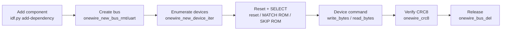
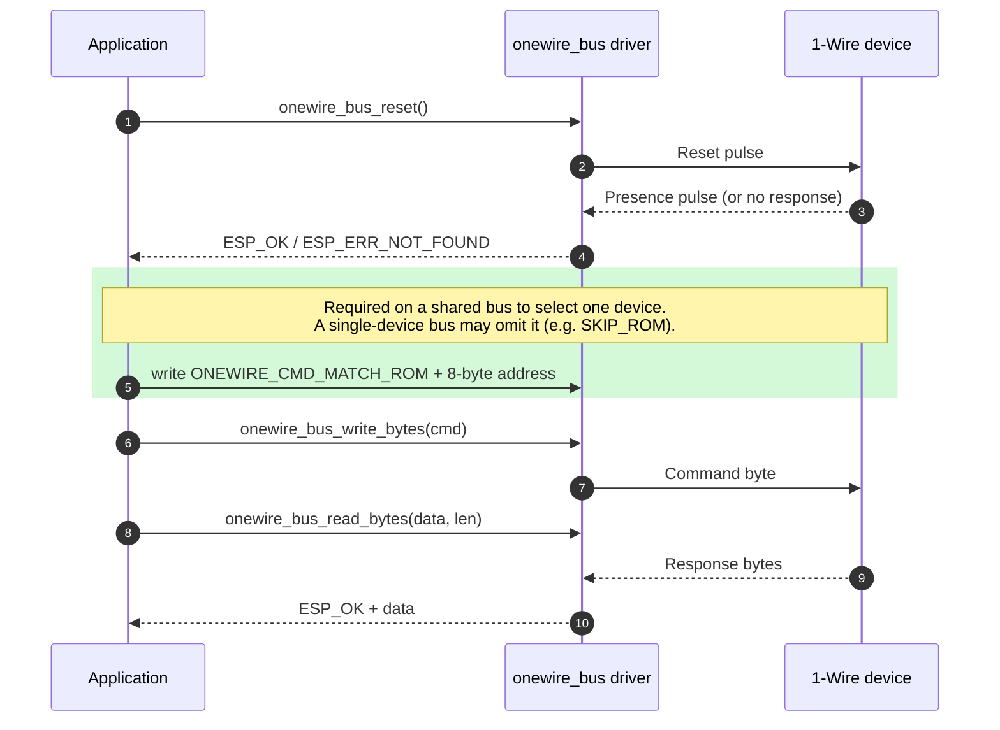

<a id="quick-start"></a>
# Quick Start Guide

This chapter is a task-oriented walk-through of the driver API. If you have not read [1-Wire Bus Basics](1-wire-basics.md) yet, do it now: the reset pulse, time slots and ROM search described there are exactly what these functions implement.



## Allocate a 1-Wire Bus with the RMT Backend

The RMT backend is the recommended approach for most ESP32 chips that support the RMT peripheral. It provides precise timing control for 1-Wire communication.

```c
#include "onewire_bus.h"

// 1-Wire bus configuration
onewire_bus_config_t bus_config = {
    .bus_gpio_num = 4,              // GPIO pin connected to the 1-Wire bus data line
    .flags = {
        .en_pull_up = false,        // Set true to enable internal pull-up (external pull-up recommended)
    }
};

// RMT backend specific configuration
onewire_bus_rmt_config_t rmt_config = {
    .max_rx_bytes = 10,             // Maximum bytes expected in a single receive operation
};

// Create the 1-Wire bus handle
onewire_bus_handle_t bus = NULL;
ESP_ERROR_CHECK(onewire_new_bus_rmt(&bus_config, &rmt_config, &bus));
```

### Notes on the RMT Backend

- The RMT backend uses a pair of RMT TX and RX channels internally
- The `max_rx_bytes` value determines the size of the internal receive buffer. Set this based on the maximum response size you expect from your devices
- An external 4.7 kΩ pull-up resistor is recommended for reliable communication, especially when multiple devices are on the bus or cable lengths are long

## Allocate a 1-Wire Bus with the UART Backend

The UART backend is an alternative that uses the UART peripheral with open-drain configuration. This is useful when RMT channels are not available.

```c
#include "onewire_bus.h"

// 1-Wire bus configuration
onewire_bus_config_t bus_config = {
    .bus_gpio_num = 4,              // GPIO pin connected to the 1-Wire bus data line
    .flags = {
        .en_pull_up = false,        // Set true to enable internal pull-up (external pull-up recommended)
    }
};

// UART backend specific configuration
onewire_bus_uart_config_t uart_config = {
    .uart_port_num = 1,             // UART port number to use
};

// Create the 1-Wire bus handle
onewire_bus_handle_t bus = NULL;
ESP_ERROR_CHECK(onewire_new_bus_uart(&bus_config, &uart_config, &bus));
```

### Notes on the UART Backend

- Both the UART TX and RX paths are configured to the same GPIO pin (`bus_gpio_num`)
- The GPIO is automatically configured as open-drain mode
- The backend emulates reset and time slots with TX bytes at two different baud rates, so it needs one free UART port

## Enumerate Devices on the Bus

After initializing the bus, you can discover all 1-Wire devices connected to it. Each 1-Wire device has a unique 64-bit ROM address (see [Device Discovery](1-wire-basics.md#device-discovery)).

```c
// Create a device iterator
onewire_device_iter_handle_t iter = NULL;
ESP_ERROR_CHECK(onewire_new_device_iter(bus, &iter));

// Enumerate all devices on the bus
onewire_device_t dev;
while (onewire_device_iter_get_next(iter, &dev) == ESP_OK) {
    ESP_LOGI("example", "Found device with address: %016llX", dev.address);
}

// Delete the iterator when done
ESP_ERROR_CHECK(onewire_del_device_iter(iter));
```

### Notes on Device Enumeration

- The iterator performs a 1-Wire search algorithm to find all devices on the bus
- Each call to `onewire_device_iter_get_next()` returns the next device found
- The device address contains the family code (first byte), serial number (middle 6 bytes) and CRC (last byte)
- Call the iterator functions again if you need to re-scan the bus for newly connected devices

## Communicate with Devices

### Communication Sequence

Every transaction on the bus follows the same pattern: [onewire_bus_reset](api.md#function-onewire_bus_reset), optional addressing, then a command/data exchange. The sequence diagram below makes the interaction between the application, the driver and the target device explicit.



### Reset the Bus

Before each communication sequence, send a reset pulse to check for device presence:

```c
esp_err_t ret = onewire_bus_reset(bus);
if (ret == ESP_OK) {
    ESP_LOGI("example", "Device(s) present on the bus");
} else if (ret == ESP_ERR_NOT_FOUND) {
    ESP_LOGW("example", "No devices found on the bus");
}
```

### Send Commands and Data

You can communicate with devices using the byte-level or bit-level functions:

```c
// Send a command byte (e.g. SKIP ROM command to address all devices)
uint8_t cmd = ONEWIRE_CMD_SKIP_ROM;
ESP_ERROR_CHECK(onewire_bus_write_bytes(bus, &cmd, 1));

// Write a read temperature command to a DS18B20
uint8_t convert_cmd = 0x44;
ESP_ERROR_CHECK(onewire_bus_write_bytes(bus, &convert_cmd, 1));

// Read response data
uint8_t scratchpad[9];
ESP_ERROR_CHECK(onewire_bus_read_bytes(bus, scratchpad, 9));
```

### Working with a Specific Device

When multiple devices are on the bus, use the `MATCH ROM` command to address a specific device:

```c
// First, find the device address using the iterator (shown above)
onewire_device_iter_handle_t iter = NULL;
ESP_ERROR_CHECK(onewire_new_device_iter(bus, &iter));

onewire_device_t dev;
if (onewire_device_iter_get_next(iter, &dev) == ESP_OK) {
    // Reset and send MATCH ROM command followed by the device address
    ESP_ERROR_CHECK(onewire_bus_reset(bus));

    uint8_t match_cmd = ONEWIRE_CMD_MATCH_ROM;
    ESP_ERROR_CHECK(onewire_bus_write_bytes(bus, &match_cmd, 1));
    ESP_ERROR_CHECK(onewire_bus_write_bytes(bus, (uint8_t *)&dev.address, 8));

    // Now you can communicate with this specific device
    uint8_t read_cmd = 0xBE;  // Read scratchpad command for DS18B20
    ESP_ERROR_CHECK(onewire_bus_write_bytes(bus, &read_cmd, 1));

    uint8_t data[9];
    ESP_ERROR_CHECK(onewire_bus_read_bytes(bus, data, 9));
}

ESP_ERROR_CHECK(onewire_del_device_iter(iter));
```

> **📝 Note**
>
> The 64-bit ROM address is transferred **LSB first**, exactly like any other 1-Wire data. Passing the little-endian `dev.address` directly is therefore correct on ESP (little-endian) targets.

## Verify Data with CRC

The 1-Wire protocol uses CRC8 for data integrity (see [Data Transfer and CRC8](1-wire-basics.md#data-transfer-and-crc8)). The driver provides a CRC8 utility function:

```c
#include "onewire_crc.h"

// Calculate CRC8 for received data
uint8_t data[9];  // Received scratchpad data
ESP_ERROR_CHECK(onewire_bus_read_bytes(bus, data, 9));

// Verify CRC - the result should be 0 if data is correct
uint8_t crc = onewire_crc8(0, data, 9);
if (crc == 0) {
    ESP_LOGI("example", "Data CRC verified OK");
} else {
    ESP_LOGE("example", "Data CRC mismatch");
}
```

## Free Resources

When you are done using the 1-Wire bus, free the allocated resources:

```c
ESP_ERROR_CHECK(onewire_bus_del(bus));
```

## Common 1-Wire Commands

The driver provides commonly used 1-Wire ROM command definitions:

| Command | Value | Description |
|---------|-------|-------------|
| `ONEWIRE_CMD_SEARCH_NORMAL` | 0xF0 | Search for all devices on the bus |
| `ONEWIRE_CMD_MATCH_ROM` | 0x55 | Address a specific device by its ROM address |
| `ONEWIRE_CMD_SKIP_ROM` | 0xCC | Address all devices on the bus simultaneously |
| `ONEWIRE_CMD_SEARCH_ALARM` | 0xEC | Search for devices in alarm condition |
| `ONEWIRE_CMD_READ_POWER_SUPPLY` | 0xB4 | Check if devices are parasitically powered |

## FAQ

- **Do I need an external pull-up resistor?**
  - Yes, a 4.7 kΩ pull-up resistor is recommended for reliable communication. The internal pull-up may not provide enough current for some devices, especially with longer cables or multiple devices.

- **Which backend should I use, RMT or UART?**
  - Use the RMT backend if your chip supports it and you have free RMT channels. It provides more precise timing. Use the UART backend when RMT is unavailable or all channels are in use.

- **How many devices can I connect to a single 1-Wire bus?**
  - The 1-Wire protocol supports many devices on a single bus (limited by the 64-bit address space). In practice, the limit is determined by bus capacitance and power supply capabilities.

- **How do I communicate with a specific device when multiple devices are on the bus?**
  - First enumerate devices using the device iterator to get their addresses. Then use the `ONEWIRE_CMD_MATCH_ROM` command followed by the 8-byte device address to select a specific device before sending commands.

- **Where can I find a complete example?**
  - See the [DS18B20 device driver](https://components.espressif.com/components/espressif/ds18b20) and the [DS18B20 Example](https://github.com/espressif/esp-bsp/tree/master/components/ds18b20/examples/ds18b20_read) for a complete working implementation based on this 1-Wire bus driver.
