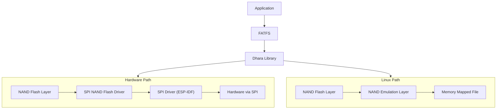

# SPI NAND Flash Driver

This driver is designed to support SPI NAND Flash with ESP chipsets.

This component incorporates the [dhara library](https://github.com/dlbeer/dhara), licenced under the [LICENCE](https://github.com/dlbeer/dhara/blob/master/LICENSE)

## About SPI NAND Flash
SPI NAND Flash combines the benefits of NAND Flash technology with the simplicity of the SPI interface, providing an efficient and cost-effective solution for non-volatile data storage in diverse applications. Its versatility, reliability, and affordability make it a popular choice for many embedded systems and electronic devices.

### Key Features:
* Non-Volatile Storage: SPI NAND Flash provides non-volatile storage, retaining data even when power is removed. This characteristic makes it ideal for storing critical system information and application data.

* SPI Interface: The SPI protocol allows for straightforward communication between the microcontroller and the NAND Flash. This simplicity in interface design facilitates easy integration into embedded systems.

* Cost-Effective: SPI NAND Flash offers a cost-effective storage solution, making it attractive for applications with budget constraints. Its competitive pricing makes it a viable option for a wide range of projects.

* High Density: NAND Flash technology inherently supports high-density storage, enabling the storage of large amounts of data in a compact form factor. This is advantageous for applications requiring extensive data storage in constrained spaces.

* Fast Read/Write Operations: The SPI interface enables reasonably fast read and write operations, making it suitable for applications where data access speed is crucial.

### Implementation Architecture


## Supported SPI NAND Flash chips

At present, `spi_nand_flash` component is compatible with the chips produced by the following manufacturers and and their respective model numbers:

* Winbond - W25N01GVxxxG/T/R, W25N512GVxIG/IT, W25N512GWxxR/T, W25N01JWxxxG/T, W25N01JWxxxG/T, W25N02KVxxIR/U, W25N04KVxxIR/U
* Gigadevice -  GD5F1GQ5UExxG, GD5F1GQ5RExxG, GD5F2GQ5UExxG, GD5F2GQ5RExxG, GD5F4GQ6UExxG, GD5F4GQ6RExxG, GD5F4GQ6UExxG, GD5F4GQ6RExxG, GD5F4GM8xExxG
* Alliance - AS5F31G04SND-08LIN, AS5F32G04SND-08LIN, AS5F12G04SND-10LIN, AS5F34G04SND-08LIN, AS5F14G04SND-10LIN, AS5F38G04SND-08LIN, AS5F18G04SND-10LIN
* Micron - MT29F4G01ABAFDWB, MT29F1G01ABAFDSF-AAT:F, MT29F2G01ABAGDWB-IT:G
* Zetta - ZD35Q1GC
* XTX - XT26G08D

## Troubleshooting

To verify SPI NAND Flash writes, enable the `NAND_FLASH_VERIFY_WRITE` option in menuconfig. When this option is enabled, every time data is written to the SPI NAND Flash, it will be read back and verified. This helps in identifying hardware issues with the SPI NAND Flash.

To configure the project for this setting, follow these steps:

```
idf.py menuconfig
-> Component config
-> SPI NAND Flash configuration
-> NAND_FLASH_VERIFY_WRITE
```

Run `idf.py -p PORT flash monitor` and if the write verification fails, an error log will be printed to the console.
